# 嵌入式系统 Bootloader + OTA 设计模式分析报告

## Executive Summary

**关键结论：** Bootloader + OTA 不应被视为“下载一个 bin 然后重启”的单一功能，而应视为由**可信启动链、镜像格式、存储事务、更新传输、版本/兼容性策略、失败恢复、密钥生命周期和发布体系**共同组成的系统。对于设计阶段，最重要的选择通常不是“HTTP 还是 MQTT”，而是先确定：**掉电时旧版本是否必须仍可启动、是否需要自动回滚、能否为第二份完整镜像提供存储、Bootloader 是否必须是不可变信任根、以及设备是否需要抵御已签名旧固件回滚攻击。**

本报告调研的主要基线包括 MCUboot、Zephyr/MCUmgr、ESP-IDF、FreeRTOS/AWS IoT OTA、U-Boot、RAUC 与 SWUpdate。MCUboot 已提供完整的镜像 Header/TLV、签名、Security Counter、多种 Swap/Direct-XIP/RAM-load 模式和 Test/Confirm/Revert 状态机；ESP-IDF 则提供成熟的 OTA 分区、首启验证、自动回滚、eFuse anti-rollback 和硬件信任根范例；嵌入式 Linux 一侧，RAUC 与 SWUpdate 分别提供 A/B、签名 Bundle、HTTP Streaming、Adaptive/Delta Update、Bootloader 集成与救援系统。citeturn20view0turn21view0turn21view1turn20view4turn21view7

### 总体推荐

| 项目情形 | 首选模式 | 备选 | 不建议作为默认方案 |
|---|---|---|---|
| 极低 Flash MCU、个人实验、可现场恢复 | 单镜像 + 独立 Bootloader | 外部 SPI Flash staging | 为省 Flash 完全取消签名/恢复入口 |
| 普通 Cortex-M、1–4 MiB Flash | **A/B / MCUboot 双槽 + Test/Confirm/Revert** | 外部 Flash staging | 原地覆盖唯一可启动镜像 |
| ESP32 类联网 MCU | **厂商原生 OTA A/B + Secure Boot + Anti-rollback** | 自定义下载层 + 原生 bootloader | 自研整套安全启动链 |
| BLE 设备 | Zephyr + MCUboot + MCUmgr/BLE | App 自定义 BLE 分片协议 | Bootloader 内塞完整业务 BLE 栈 |
| LoRaWAN/极低带宽 | A/B/外部 staging + 小块传输；必要时差分 | 有线/手机网关恢复 | 每次通过 LoRaWAN 发送完整大镜像 |
| 有 QSPI NOR、内部 Flash 紧张 | **外部 staging + 内部运行镜像** | Direct-XIP（硬件允许时） | 在唯一内部 App 上直接 patch |
| Embedded Linux/eMMC | **U-Boot + RAUC A/B** 或 **U-Boot + SWUpdate** | A/B + Recovery | 单 rootfs 直接覆盖 |
| 企业大规模 Fleet | **A/B + Recovery + Secure/Verified Boot + anti-rollback + PKI/HSM + staged rollout** | 外部 staging + Recovery | 单镜像无自动回滚 |
| 高网络成本、Linux 大镜像 | RAUC Adaptive / SWUpdate Delta | 压缩全量镜像 | 把差分补丁直接原地作用于运行分区 |

MCUboot 明确提供 Test → Confirm 或 Revert 的更新模型；ESP-IDF 的新镜像也经历 NEW/PENDING_VERIFY/VALID 类似的首启确认过程。两者所体现的共同设计原则非常值得直接采用：**“签名正确”只证明软件来自授权发布者，并不能证明它在当前硬件和数据状态下能够正常运行，因此 cryptographic verification 之后仍需要 runtime health confirmation。** citeturn20view0turn21view0

### 建议采用的系统边界

推荐将 OTA 系统拆为四层：

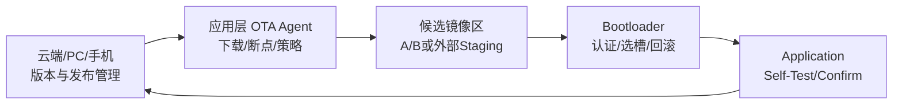

其中 **Bootloader 应尽量不负责 Internet 协议与复杂业务逻辑**。TLS、MQTT、HTTP、CoAP、BLE 配网、云端鉴权等通常放在 Application/OTA Agent；Bootloader 只承担最小可信功能：镜像解析、边界检查、签名验证、anti-rollback、选槽、事务恢复、跳转和必要的本地 recovery。这样既减小攻击面，也降低 Bootloader 升级需求。MCUboot 本身将主要逻辑抽象为 `bootutil` 并专门强调可单元测试性，这也是相同思想的体现。citeturn20view0

### 个人项目与企业级项目的本质区别

“个人项目”和“企业级项目”**不是两种 Bootloader 架构**。A/B 同样可以用于个人项目，单镜像也可能出现在企业低成本设备。真正的区别主要是**风险成本和生命周期工程**：

| 项目维度 | 个人项目合理基线 | 企业级建议基线 |
|---|---|---|
| 镜像真实性 | 固定离线签名密钥 | PKI/HSM/KMS，生产与开发密钥隔离 |
| Secure Boot | 有条件启用 | 原则上应启用，形成硬件信任根 |
| Anti-rollback | 可选 | 高安全设备建议必选 |
| 回滚 | A/B 或手工 Recovery | 自动 Test/Confirm/Revert |
| 发布 | 手工签名/上传 | CI 构建、隔离签名、审批、发布 |
| 部署 | 全量发布可接受 | Canary → 小批 → 分阶段 → 全量 |
| 可观测性 | 串口日志 | Fleet 状态、失败原因、版本分布、审计 |
| Key 管理 | 加密离线保存 | HSM/PKCS#11/KMS、轮换、吊销、审计 |
| 测试 | 功能 + 几次掉电 | 自动故障注入 + Power-cut + 长稳 + Compatibility |
| 法务合规 | 保留 LICENSE 即可起步 | SBOM、许可证扫描、第三方代码归档、source-offer 等 |
| 恢复能力 | SWD/UART 人工救砖 | 无人值守恢复/Recovery partition/现场维修流程 |

RAUC 已原生支持 PKCS#11，包括智能卡、USB Token、HSM，甚至通过 PKCS#11 后端使用云 KMS；AWS FreeRTOS OTA 的官方流程则明确涉及代码签名证书、S3、服务角色和 OTA 权限。这些更接近企业级发布系统，而不仅是设备端 OTA。citeturn22view3turn22view5

**需要特别纠正一个常见认识：** HTTPS 并不能代替 Firmware Signature。HTTPS 保护的是“本次通信会话”；镜像签名保护的是“这个二进制是否由授权发布者产生”，并且允许 Bootloader 在完全离线状态下验证。安全 OTA 最合理的默认值是：

> **TLS/DTLS 保护传输 + 数字签名保护镜像 + Secure Boot 保护每次启动 + Security Counter 防止旧的合法签名镜像回滚。**

ESP32 Secure Boot v2 就是典型例子：ROM 验证二级 Bootloader，二级 Bootloader 验证 Application，设备中的 eFuse 保存受保护的公钥摘要；ESP-IDF OTA 还可用 eFuse `security_version` 实现 anti-rollback。citeturn21view3turn21view4turn21view1

## 设计输入与资源约束

**关键结论：** 当前需求没有指定目标 MCU/SoC、Flash/RAM、网络、掉电模型、安全等级以及生命周期，因此不能给出唯一“最佳架构”。在设计冻结前，至少应先明确 **Flash 擦写粒度、最大镜像尺寸、是否有外部非易失存储、是否允许两份完整镜像、掉电是否频繁、是否存在硬件 Trust Root、现场是否可物理恢复**。下面使用低/中/高三种假设配置建立后续决策矩阵，这些数值是本报告用于设计分析的**工程场景假设，不是行业标准或厂商规格**。

### 典型目标配置假设

| 配置 | 本报告假定硬件 | 典型业务 | 优先目标 |
|---|---|---|---|
| 低资源 L | 512 KiB Flash / 128 KiB RAM，无外部 Flash，BLE/UART | 传感器、小控制器 | Flash 成本最低 |
| 中资源 M | 2 MiB Flash / 512 KiB RAM，可选 QSPI，Wi-Fi/BLE/Ethernet | IoT 网关、控制设备 | 可靠 OTA + 安全 |
| 高资源 H | Cortex-A/RISC-V Linux，512 MiB+ RAM，4 GiB+ eMMC | 工业 Linux、Edge Gateway | A/B、PKI、远程运维 |

MCUboot 面向 32-bit MCU，并已用于 Zephyr、Mynewt、NuttX、RIOT、Mbed OS、Espressif、Cypress/Infineon 等生态，因此很适合把它作为 MCU 类设计的参考基线，而不是围绕某个特定 Cortex-M 型号设计私有 Bootloader。citeturn22view6

### 真正决定 Bootloader 设计的硬件属性

| 硬件属性 | 为什么影响架构 | 设计检查项 |
|---|---|---|
| Flash 总容量 | 决定能否 A/B | `B + 2I + M <= Flash`？ |
| Erase sector/page | 决定 swap、metadata 原子性 | 最小 sector、多尺寸 sector |
| Minimum write size | 影响 trailer/status 格式 | 1/2/4/8/16-byte program unit |
| Read-while-write / Dual Bank | 决定 App 运行时能否写另一区域 | 写 Flash 时 CPU 是否 stall |
| 外部 QSPI NOR | 可转移 OTA staging 空间 | Bootloader 能否初始化 QSPI |
| eMMC/SD | Linux A/B 的天然介质 | GPT、boot partition、可靠写 |
| OTP/eFuse | 可形成不可变 Trust Root | 公钥 Hash、安全计数器 |
| HW Crypto | 减少 SHA/RSA/ECC 时间 | 算法与 ROM API 是否可用 |
| TRNG | 生产密钥/会话安全 | 熵质量 |
| Watchdog | 首启失败自动恢复 | Bootloader 能否识别 watchdog reset |
| Backup Register/RTC RAM | 可保存重启原因 | 不能作为唯一可信事务状态 |
| UART/USB/SWD | 最终 Recovery | 量产时是否锁调试接口 |

MCUboot 的交换算法直接受 Flash sector 和 minimum-write-size 约束，并且其 image trailer 保存每个 sector 的 swap 进度，因此 Flash 几何不是实现后期的小细节，而是架构输入。MCUboot 甚至给出了 scratch wear 与镜像尺寸、scratch 尺寸和 Flash erase-cycle 的关系。citeturn20view0

### 建议的容量模型

定义：

```text
B = Bootloader 占用
I = 最大“签名后”Application 镜像
M = OTA Metadata / Trailer / State
S = Flash 最大擦除扇区
P = 最大差分 Patch
E = 外部 Staging 容量
W = Patch/Decompression Workspace
```

则设计阶段可以直接使用：

| 模式 | Internal Flash 粗略下限 |
|---|---:|
| 单镜像 | `B + I + M` |
| A/B Direct-XIP | `B + 2I + 2M` |
| MCUboot Swap | `B + 2I + trailers (+ scratch/extra sector)` |
| 外部 staging | `B + I + M`，另需 `E >= I` |
| 差分 + A/B | `B + 2I + P + M`，若 patch 可流式则 P 可外置 |
| Recovery + A/B | `B + 2I + Rcv + M` |

这里不能简单认为“两个 768 KiB Slot 就能装两个 768 KiB App”。例如 MCUboot 明确指出，Image Trailer 占用 slot 末尾空间，所以 maximum image size 是 `slot size - trailer size`；不同 swap 算法还可能要求额外 sector。citeturn20view0

### 一个可直接讨论的 2 MiB MCU 分区示例

以下是假定 4 KiB sector 的**设计示例**：

| 区域 | 起始地址 | 大小 | 用途 |
|---|---:|---:|---|
| Bootloader | `0x00000000` | 128 KiB | Secure Boot / slot selection |
| Slot A | `0x00020000` | 768 KiB | Primary |
| Slot B | `0x000E0000` | 768 KiB | Secondary |
| OTA State | `0x001A0000` | 32 KiB | 双副本状态/下载记录 |
| NVS/Config | `0x001A8000` | 128 KiB | 持久配置 |
| Crash Log | `0x001C8000` | 64 KiB | reboot/crash telemetry |
| Reserve | `0x001D8000` | 160 KiB | 扩展/对齐/未来 Bootloader |
| Flash End | `0x00200000` | — | — |

实际地址必须根据芯片的 vector table、Flash bank、sector geometry、Boot ROM 约束和 linker script 调整。对于 MCUboot，还必须从每个 slot 中进一步扣除 image trailer。citeturn20view0

### MCU 与 Embedded Linux 的边界

对于 Cortex-M 级 MCU，Bootloader 通常直接理解 MCU Flash geometry，并跳转到 Application vector；对于 Embedded Linux，更新单元更常是 kernel/rootfs/boot partition，Bootloader 与 updater 之间通过 boot variables 或 slot metadata 交互。RAUC 可以与 U-Boot、Barebox、GRUB 等 bootloader 连接，并把 boot-success/failure 状态反馈给引导逻辑；SWUpdate则支持 rootfs、kernel、bootloader、甚至附属 MCU firmware 等多类 Artifact。citeturn20view4turn21view6turn21view7

因此不建议试图用“一套 C Bootloader 架构”覆盖 MCU 与 Embedded Linux；应该统一**状态模型和安全原则**，而不是强行统一实现。

## 启动链、安全启动与镜像机制

**关键结论：** 推荐把启动链设计为“最小不可变根 → 可升级 Bootloader → 已认证 Application”。镜像认证至少包含 **边界检查、硬件兼容检查、hash、数字签名、Security Counter**；OTA 的下载完整性检查不能替代 Boot-time 验证。新镜像首次启动后必须经过 self-test 才能永久确认。

### 推荐启动流程

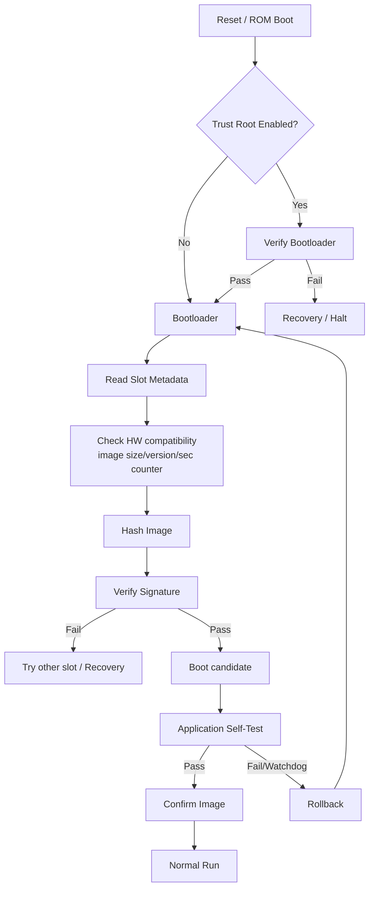

ESP32 Secure Boot v2 是这一模型的具体硬件实现：第一阶段 ROM Bootloader 验证二级 Bootloader 的 RSA-PSS 签名，二级 Bootloader 再验证 Application；公钥摘要存入 eFuse。官方还明确指出 Application 在 OTA 时以及每次启动时都被验证。citeturn21view3turn21view4

U-Boot Verified Boot 描述了同样的链式模型，并强调验证公钥本身必须位于不可被攻击者替换的可信位置；还推荐不同启动阶段使用不同签名密钥，以降低一个阶段密钥泄露导致整条链失陷的风险。citeturn21view9

### Secure Boot、Signed OTA 和 Encryption 必须区分

| 机制 | 解决的问题 | 不解决的问题 |
|---|---|---|
| Hash | 意外损坏 | 攻击者可重新算 Hash |
| Digital Signature | Firmware authenticity + integrity | 不隐藏固件 |
| Secure Boot | 防止设备执行未授权代码 | 不保护下载链隐私 |
| TLS/DTLS | 网络端点认证、会话机密性/完整性 | 下载后长期真实性 |
| Firmware Encryption | 隐藏固件内容 | 单独使用不能证明发布者 |
| Anti-rollback | 阻止合法但旧的脆弱版本 | 不证明新版运行正常 |
| Rollback | 新版故障恢复旧版 | 与“Anti-rollback”不是同一概念 |

其中最后两个名称尤其容易混淆：

**Rollback** 是可靠性功能：`v2` 启动失败，返回 `v1`。

**Anti-rollback** 是安全功能：如果 `v1` 已知存在漏洞，即使它拥有合法签名，也不再允许启动。

ESP-IDF 正是同时支持这两个机制；其 anti-rollback 要求 Firmware 的 security version 不低于 eFuse 中的版本，同时允许在符合 security counter 约束的情况下实施可靠性回滚。citeturn21view1

### 推荐版本模型

不要只有一个 `firmware_version = 1.2.7`。

建议至少拆成：

```text
display_version     = 1.12.3+build.482
security_counter    = 9
board_id            = CTRL-A7
hw_rev_min          = 2
hw_rev_max          = 5
image_schema        = 3
boot_api_min        = 2
data_schema         = 7
```

MCUboot 的 image header 原生包含 major/minor/revision/build number，并提供 dependency TLV 与 `IMAGE_TLV_SEC_CNT` Security Counter；ESP-IDF 则独立维护 eFuse `security_version`。citeturn20view0turn21view1

因此推荐：

```text
semantic/product version != security version
```

不能因为 `2.0.0 > 1.9.9` 就认为它天然安全；Security Counter 应只在**必须永久禁止更旧安全代际**时递增。

### 镜像元数据格式示例

下面不是 MCUboot 二进制格式，而是适合项目设计文档的**抽象 Manifest**：

```c
#define OTA_MAGIC 0x4F544131u  /* "OTA1" */

struct ota_image_manifest_v1 {
    uint32_t magic;
    uint16_t manifest_version;
    uint16_t header_size;

    uint32_t image_type;         /* APP / RADIO / FPGA / ... */
    uint32_t image_size;

    uint32_t board_id;
    uint16_t hw_rev_min;
    uint16_t hw_rev_max;

    uint16_t ver_major;
    uint16_t ver_minor;
    uint16_t ver_patch;
    uint32_t build_number;

    uint32_t security_counter;
    uint32_t boot_api_min;
    uint32_t data_schema;

    uint8_t  payload_sha256[32];

    uint16_t signature_algorithm;
    uint16_t signature_size;
    uint8_t  signing_key_id[16];

    uint32_t flags;              /* encrypted/compressed/delta/... */
    uint32_t base_version;       /* for delta image */

    /* immutable extension TLVs follow */
};
```

最重要的设计规则是：

> **版本、Hardware ID、Security Counter、Image Size、Dependency、Payload Hash 等影响“这是什么镜像”的字段必须处于签名保护范围。**

MCUboot 同样将 protected TLV 纳入镜像 hash，并提供 hash、RSA-PSS、ECDSA、Ed25519、dependency、security counter、encryption 和 compressed-image metadata 等 TLV 类型。citeturn20view0

而类似以下内容应是**可变运行状态**，不要和发布 Manifest 混为一个对象：

```text
downloaded_bytes
selected_slot
boot_attempt_count
candidate_pending
image_confirmed
swap_progress
last_error
```

### 签名验证伪代码

```c
bool verify_candidate(const image_t *img)
{
    manifest_t m;

    if (!read_manifest(img, &m))
        return false;

    /* 先做便宜的边界检查，避免恶意长度引起越界 */
    if (m.magic != OTA_MAGIC ||
        m.header_size > MAX_HEADER ||
        m.image_size > SLOT_PAYLOAD_MAX)
        return false;

    /* 防止刷入错误硬件型号 */
    if (m.board_id != DEVICE_BOARD_ID ||
        DEVICE_HW_REV < m.hw_rev_min ||
        DEVICE_HW_REV > m.hw_rev_max)
        return false;

    /* anti-rollback */
    uint32_t min_security_version = otp_read_security_counter();
    if (m.security_counter < min_security_version)
        return false;

    /* 获取 Bootloader 已信任的公钥，而不是镜像自行指定可信 key */
    const public_key_t *key =
        trusted_key_lookup(m.signing_key_id);

    if (key == NULL)
        return false;

    /* Hash 应流式计算，不必把整个镜像放进 RAM */
    sha256_ctx_t ctx;
    sha256_init(&ctx);

    hash_signed_manifest_fields(&ctx, &m);

    for_each_payload_chunk(img, chunk) {
        sha256_update(&ctx, chunk.data, chunk.len);
    }

    uint8_t digest[32];
    sha256_final(&ctx, digest);

    if (!constant_time_equal(digest, m.payload_sha256, 32))
        return false;

    if (!verify_signature(key,
                          m.signature_algorithm,
                          digest,
                          img->signature,
                          m.signature_size))
        return false;

    return true;
}
```

ESP32 Secure Boot v2 的真实验证流程非常接近该抽象：首先检查 signature block 中公钥的 SHA-256 digest 是否匹配 eFuse 中的可信 digest，再计算 Image Digest，最后执行 RSA-PSS verification；ESP32 的 Secure Boot v2 使用 RSA-3072、SHA-256、MGF1，并指定 32-byte salt。citeturn21view3

### Key Management

推荐将密钥分为至少三类：

| Key | 所在位置 | 作用 |
|---|---|---|
| Root / Verification Public Key | ROM/OTP/eFuse/受保护 Bootloader | 验证 Firmware |
| Firmware Signing Private Key | **永远不进入设备** | Release Signing |
| TLS Device Credential | Device Secure Storage/SE | 云端设备认证 |

企业项目再拆分：

```text
Root CA
 ├── Development Signing Key
 ├── QA/Staging Signing Key
 └── Production Release Signing Key
```

企业生产签名私钥最好由 HSM/KMS/PKCS#11 托管，而不是作为 CI 环境变量长期保存。RAUC 已提供 PKCS#11 HSM、USB token 和 KMS 后端示例，可以直接作为发布架构参考。citeturn22view3

## 常见 Bootloader + OTA 设计模式

**关键结论：** 实际产品最值得比较的是七种模式。可靠性从“单镜像”向“A/B + Recovery”提升，同时 Flash、实现复杂度和测试成本也增加。**A/B 是大多数中等资源联网 MCU 的甜点位；Embedded Linux 通常直接选择 A/B；外部 Flash staging 是解决内部 Flash 不足最常见的折中；差分更新是传输优化，不应该替代可靠的最终镜像槽。**

为简洁起见，以下资源估算使用前文 `B/I/M/P/E/W` 符号；复杂度为本报告的工程评估。

### 模式总览

| 模式 | Internal Flash | 自动回滚 | 掉电鲁棒性 | 带宽 | 实现复杂度 |
|---|---|---:|---|---|---|
| 单镜像 | 最低 | ✕ | 低～中 | 全量 | 低 |
| A/B 双镜像 | 高 | ✓ | 高 | 全量 | 中 |
| 外部 Staging | 低～中 | 视实现 | 高 | 全量 | 中 |
| 差分/压缩 | 中 | 应结合 A/B | 高 | **最低** | 高 |
| 网络引导 | 低本地存储 | N/A/视设计 | 依赖网络 | 每次可能全量 | 中～高 |
| 分阶段可信引导 | 中 | 与 slot 独立 | 高安全性 | 无直接影响 | 高 |
| A/B + Recovery | 最高 | ✓ | **最高** | 全量/可差分 | 高 |

**模式：单镜像 / In-place Replacement**

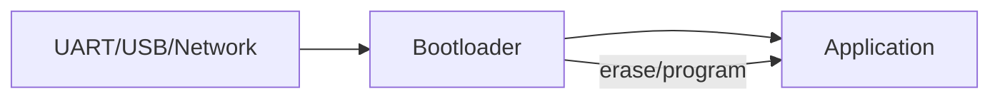

其本质是设备中没有另一份完整、已知良好的 Application。通常设备先进入 Bootloader，然后擦除旧 App 并烧写新 App。

资源模型：

```text
Internal ~= B + I + M
RAM      ~= transport buffer + hash/crypto context
```

优点是 Flash 最省、Bootloader 简单；缺点是**擦除之后发生掉电就没有正常 Application 可启动**，所以必须依赖 Bootloader 本身继续接收镜像。其可靠性边界因此不是“永不变砖”，而是“Application 损坏后仍可进入 Recovery Bootloader”。

适用：个人项目、开发板、现场可插 USB/UART 的设备、Flash 极度紧张且产品可以人工维护。

不适合：无人值守设备、高维护成本设备、远程工业节点。

典型实现可以使用 MCUboot 的 overwrite 类更新思路，但一旦没有第二份完整可恢复镜像，就不能得到真正的 A/B rollback 保障。MCUboot 官方也明确区分 overwrite 与 swap 策略。citeturn20view0

安全要求仍然是**必须签名**。不要因为 Bootloader 只能通过 USB 接触就取消认证；物理维护接口同样可能成为持久植入点。

测试重点：擦除第一 sector 后断电、随机 sector 写一半断电、错误镜像长度、错误签名、传输中断、重复恢复。

**模式：A/B 双镜像**

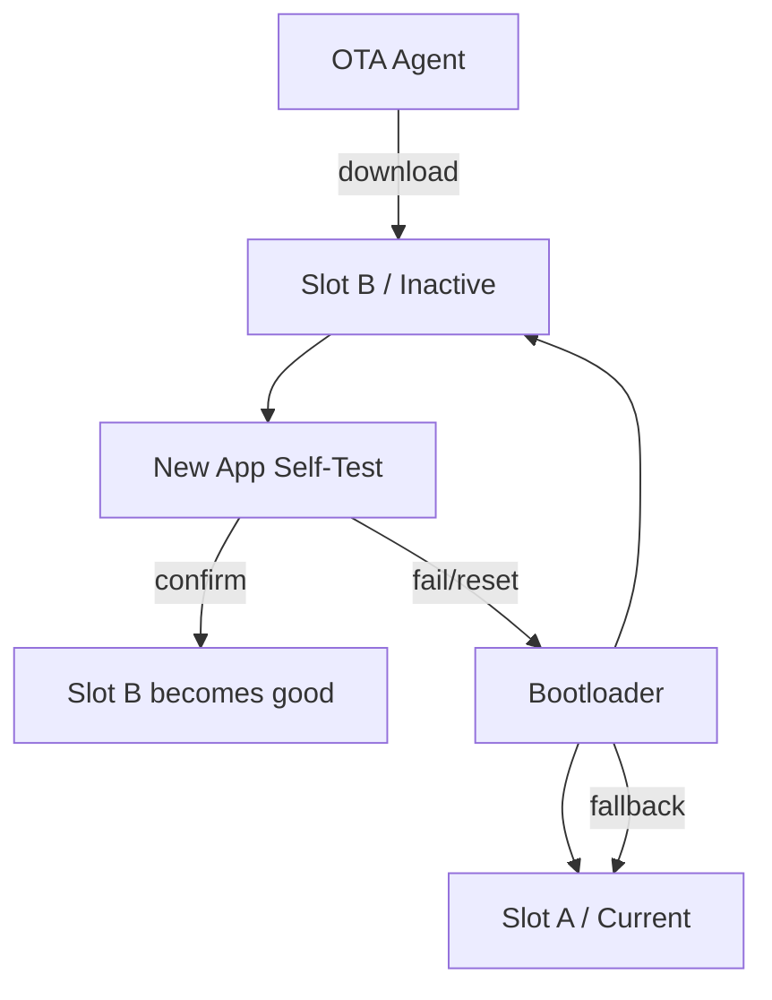

资源模型：

```text
Internal ~= B + 2I + metadata/trailer
```

这是推荐给绝大多数有足够 Flash 的 MCU 的默认架构。

它又可进一步分成两类：

**Swap/Copy 型**：Application 总在固定地址运行，升级时 Bootloader 把 Secondary 交换/复制到 Primary。MCUboot 是代表。其好处是 Application linker address 不变；代价是 upgrade 时会多次擦写 Flash。MCUboot 为此定义 image trailer、swap status，以及 scratch / offset / move 等交换方式。citeturn20view0

**Direct-XIP A/B 型**：A、B 都可直接运行，新版从哪个 slot 启动就执行哪个 slot。优点是切换快、写放大低；代价是镜像必须正确链接/重定位，或者硬件支持 bank remapping。MCUboot 也提供 equal-slot Direct-XIP，并从两个 Slot 中选择合适镜像进行认证。citeturn20view0

ESP-IDF OTA 是另一个成熟 A/B 范式。新镜像首次启动后处于需验证状态，Application 必须通过自测后调用 API 确认；否则 Bootloader 可以回滚到之前的有效镜像。citeturn21view0

优点：自动回滚、Power-fail 安全性高、发布模型清晰。

缺点：接近 2 倍 Application Flash。

适用：联网 IoT、工业控制、家庭设备、BLE 产品以及中等资源 MCU。

安全重点：两个 Slot **都必须在启动时验证**，不能认为“之前验证过 A，所以永远可信”；选槽 metadata 不能绕过 signature/security counter。

测试重点：下载完成前断电、mark-pending 前后断电、Bootloader swap 每一个 sector 后断电、首次启动 crash、确认 API 前 watchdog reset、确认之后重启、A/B 同时损坏。

**模式：外部存储 Staging**

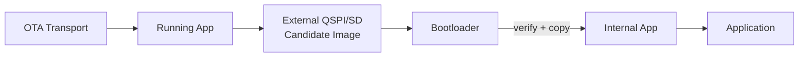

资源模型：

```text
Internal ~= B + I + M
External >= I
```

这是“内部 Flash 不够做 A/B，但 PCB 上可以增加 SPI NOR”的典型方案。

优点是几乎不占第二个内部 Image Slot；下载期间不会破坏运行中的 App；外部 NOR 成本通常容易独立扩展。

缺点是 Bootloader 必须包含 QSPI/SPI/SD 初始化路径，而且复制期间仍需解决掉电事务问题。如果 Bootloader 擦除了唯一内部 Application 后断电，而外部 candidate 又损坏，则恢复能力取决于外部镜像是否仍完整。

较好的方案是：

```text
Download external
→ hash/signature verify
→ mark STAGED
→ reboot
→ Bootloader 再验证
→ sector-by-sector transactional copy
→ final verify
→ mark ACTIVE
```

MCUboot 具备 RAM-load 模式，官方明确讨论了镜像位于外部存储、复制进内部 RAM、认证后执行的场景；其架构可以作为外部存储启动设计的重要参考。citeturn20view0

典型开源实现：MCUboot + Zephyr Flash Map；Embedded Linux 一侧 SWUpdate 也支持多种 NOR/NAND/eMMC/SD 类型和自定义 handler。citeturn20view0turn21view7

安全重点：外部 SPI NOR 通常不应被视为可信存储；从外部读取后必须重新认证，不能仅依赖下载期间验证。

测试重点：拔掉/损坏外部 Flash、复制每个 sector 时断电、external image bit flip、external metadata 与 payload 不一致。

**模式：差分 Patch / 压缩更新**

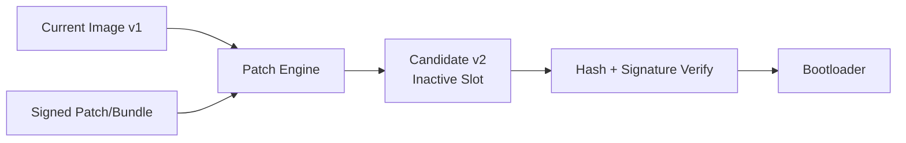

这里必须明确：

> **差分更新是一种“传输/生成候选镜像”的优化，不应成为 Bootloader 可靠性模型。**

最安全设计是：

```text
旧镜像 + Patch
    ↓
完整 v2 写入 Inactive Slot
    ↓
对完整 v2 执行厂商签名验证
    ↓
正常 A/B 激活
```

而不是：

```text
Patch 直接原地修改 Current Slot   ← 高风险
```

SWUpdate 已提供基于 `librsync` 的 delta update。RAUC 则采用 Adaptive Update：其 `block-hash-index` 为每个 4 KiB block 建 SHA-256 索引，根据目标设备已经存在的相同 Block 复用数据，只下载缺失部分；官方说明索引约为镜像的 0.8%，并给出了小改动 ext4 镜像只需下载约 10% Bundle 的实测示例，但该比例显然不能作为所有镜像的固定压缩率。citeturn21view7turn22view4

MCUboot 当前 image format 也定义了 compressed image 的 decompressed size/hash/signature 等 TLV 元数据。citeturn20view0

优点：大幅减少网络流量，特别适合蜂窝、卫星、LoRaWAN 或数百 MiB Linux rootfs。

缺点：实现、测试和版本管理复杂；必须知道正确 base image；CPU 和 I/O 开销增加。

资源模型：

```text
Storage = normal A/B + P
RAM     = chunk buffer + patch/decompress workspace W
CPU     = hash(full image) + patch/decompression
```

企业建议始终保留 Full Image fallback：如果设备报告的 base hash 不匹配，就退回全量 OTA，而不是尝试“差不多能 patch”。

**模式：网络引导 / Network Boot**

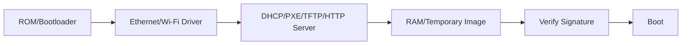

网络引导和 OTA 并不是完全相同的东西。

**OTA** 的核心目标是“把一个新版本持久安装到设备”。

**Network Boot** 的核心目标是“当前启动时从网络取得要运行的镜像”。

U-Boot 是该模式的典型成熟实现，其标准启动体系支持网络启动/PXE 类 boot method，并且可以用 Verified Boot/FIT signature 验证获得的镜像。citeturn20view7turn22view9

TFTP 由 RFC 1350 定义，是建立在 UDP 上的非常简单的文件传输协议，每个非最终数据包都有确认机制。它适合 Boot ROM、工厂网络或 Recovery 场景，但本身不应承担 Firmware Authenticity；即使 TFTP 位于封闭 LAN，也仍推荐用签名镜像。citeturn17view2

优点：设备本地只需要较小 Recovery；实验室部署、无盘 Linux、工厂烧录、现场救援非常方便。

缺点：启动强依赖网络；Bootloader 网络栈扩大攻击面；Wi-Fi/TLS 甚至证书生命周期会显著提高 Bootloader 复杂度。

因此 MCU 项目的默认建议是：

> **网络协议留在 Application；Bootloader Network Boot 仅作为 Recovery/Manufacturing 功能，而不是主要 OTA 路径。**

**模式：分阶段 / Chain-of-Trust Boot**

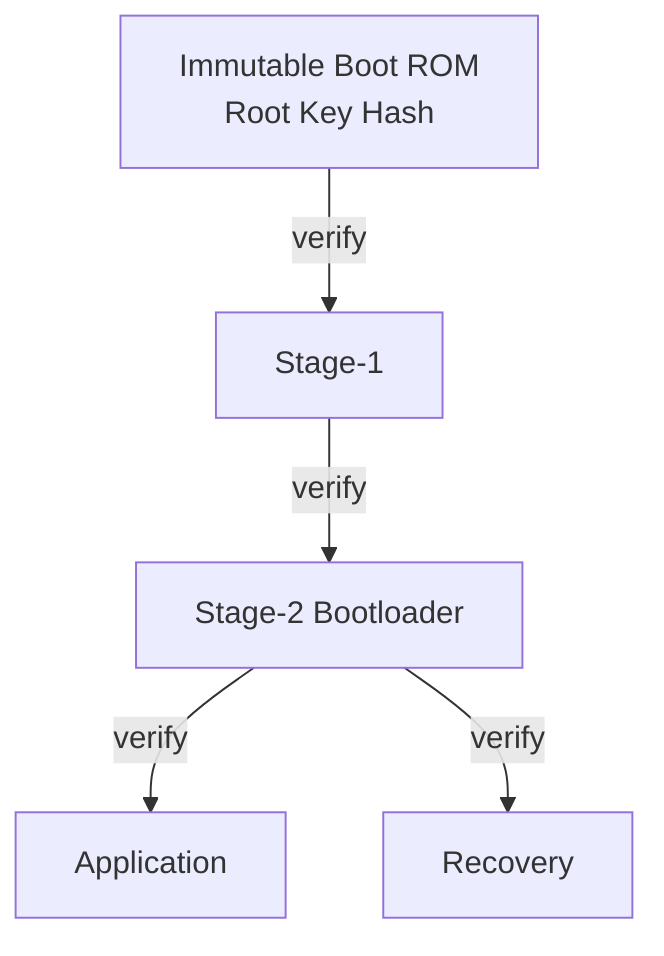

这种模式解决的是“Bootloader 自己怎么升级而仍然可信”。

ESP32 Secure Boot v2 就是典型的 ROM → Second-stage Bootloader → Application 验证链。citeturn21view3turn21view4

U-Boot 官方 Verified Boot 文档同样描述了 Master Key 验证 First Stage，再由 First Stage 中受信任的 Secondary Key 验证下一阶段，而且建议每个 stage 使用不同密钥。citeturn21view9

优点：Bootloader 可升级；信任链清晰；适合复杂 SoC。

缺点：密钥轮换、版本依赖、rollback counter、Bootloader compatibility 都明显复杂化。

企业项目可以把 Stage-1 做成尽可能小且很少更新的 Root Loader，把网络、文件系统和复杂更新功能留给 Stage-2。

**模式：A/B + 独立 Recovery**

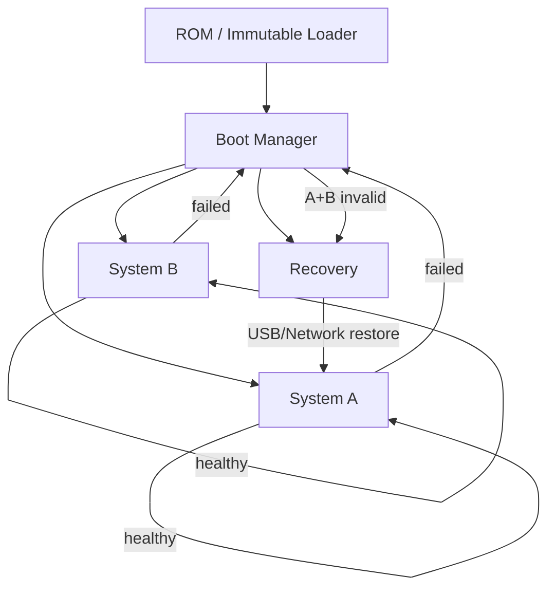

这是企业级无人值守设备最稳妥的模式之一。

与普通 A/B 相比，它处理的是：

```text
A 损坏
+
B 也损坏
+
OTA metadata 损坏
```

此时还有一个尽量稳定、尽量小的 Recovery Environment。

RAUC 官方明确建议当 Boot Slot 无法使用时，应设计 redundant fallback 或 Recovery System，并建议使用 hardware watchdog 判断设备未能正常启动的场景。citeturn21view6

SWUpdate 也将“小型 Rescue System”作为其支持场景之一。citeturn21view7

缺点是空间和验证成本最高，因此低成本 MCU 不一定划算；但对于汽车、工业网关、远程基站、无人现场设备，**一次 truck roll 的成本往往远高于多一个 Recovery 分区的存储成本**。后半句属于工程决策而非厂商规范。

## OTA 传输、差分、状态机与 Bootloader/Application 接口

**关键结论：** Transport 与 Bootloader 应解耦。HTTP、MQTT、CoAP、BLE、LoRaWAN 负责“把 Candidate 数据送到 staging”；是否允许启动，应最终由本地可信验证决定。断点续传至少分为两个问题：**下载断点续传**与**Flash swap/install 断点恢复**，不能用一个 offset 字段同时解决两者。

### 协议选择

| Transport | 最适合 | 优势 | 主要代价 | 推荐安全方式 |
|---|---|---|---|---|
| HTTPS | Wi-Fi/Ethernet/Linux | CDN、Range、易调试 | TLS RAM/Flash | TLS + Firmware Signature |
| HTTP | 内网/受控链路 | 简单 | 无传输机密性/认证 | 至少 Signature |
| MQTT | IoT Fleet 控制 | 长连接、命令/状态 | 不适合天然大文件语义 | TLS + signed artifact |
| CoAP | 约束网络 | 小开销、UDP | 大镜像需 block transfer | DTLS/OSCORE + signature |
| TFTP | Boot/Recovery/LAN | 极简 | 安全能力弱 | 网络隔离 + signature |
| BLE | 手机/近场 DFU | 不依赖互联网 | MTU/断连/移动端状态 | BLE security + signature |
| LoRaWAN | 超低带宽远程节点 | 长距离 | OTA 时间/空口成本高 | LoRaWAN security + signature |
| UART/USB | Manufacturing/Recovery | 可预测 | 需物理访问 | signature 仍建议启用 |

AWS FreeRTOS 的 OTA 官方前置文档明确支持 HTTP 或 MQTT 路径，并要求配置 OTA 相关权限及代码签名证书，可作为 IoT Cloud OTA 的成熟参考。citeturn22view5

Zephyr MCUmgr 则支持 Serial、BLE、IPv4/IPv6 UDP（可选 DTLS）、LoRaWAN、SPI 等 transport，非常适合研究“OTA Management Protocol 与 transport 解耦”的实现。citeturn22view0turn22view1turn22view2

这里应特别纠正“LoRa OTA”的术语：Zephyr 官方 MCUmgr 支持的是 **LoRaWAN transport**。Raw LoRa 只有 PHY/Radio 层能力时，项目仍需自行设计 session、fragment、retransmission、deduplication、authentication 等机制。因此在需求阶段应确认用户所说的是 **LoRa PHY** 还是 **LoRaWAN 网络**。citeturn22view0

### CoAP 的位置

CoAP 本身就是针对低功耗、低 RAM/ROM、易丢包网络设计的轻量 Web Transfer Protocol，并使用 UDP，可结合 DTLS。citeturn16view0

由于 Firmware 远远大于一个约束网络 datagram，CoAP OTA 实际上通常需要 Block-Wise Transfer。RFC 7959 定义了 Block1/Block2，Block 中包含 block number、more flag 与 block size，因此天然适合设计成分块传输和 resume checkpoint。citeturn17view0turn17view1

### MQTT 更适合控制面还是数据面

对于较大 Firmware，本报告更推荐：

```text
MQTT:
    发布通知
    Target Version
    URL
    Manifest Hash
    rollout command
    update result

HTTPS:
    bulk firmware payload
```

而不是强制把数 MiB Image 全拆为 MQTT message。

这不是协议能力限制，而是设计层面的职责分离。对于非常小的 MCU 镜像或平台已有成熟 MQTT OTA chunking，实现全 MQTT 仍然合理；AWS FreeRTOS 同时提供 HTTP/MQTT OTA 路径，说明两种架构都成立。citeturn22view5

### 断点续传应分三层

**下载层 checkpoint：**

```text
image_id
expected_size
verified_manifest_hash
next_offset
rolling/hash state（可选）
chunk bitmap（乱序时）
```

HTTPS 可以通过 Range 继续；RAUC 的 HTTP Streaming 就明确依赖 HTTP Range Requests，而且可以不先把完整 Bundle 保存到本地。citeturn21view5

**Install/swap 层 checkpoint：**

```text
current_sector
copy_phase
source_slot
target_slot
transaction sequence
```

MCUboot image trailer 中保存 Swap Status，目的就是让中途 reset 后的交换过程能够继续判断状态。citeturn20view0

**First Boot 层状态：**

```text
PENDING
BOOTING
CONFIRMED
FAILED
```

ESP-IDF 与 MCUboot 均采用这种“先试运行、再确认”的思想。citeturn21view0turn20view0

### 推荐完整 OTA 状态机

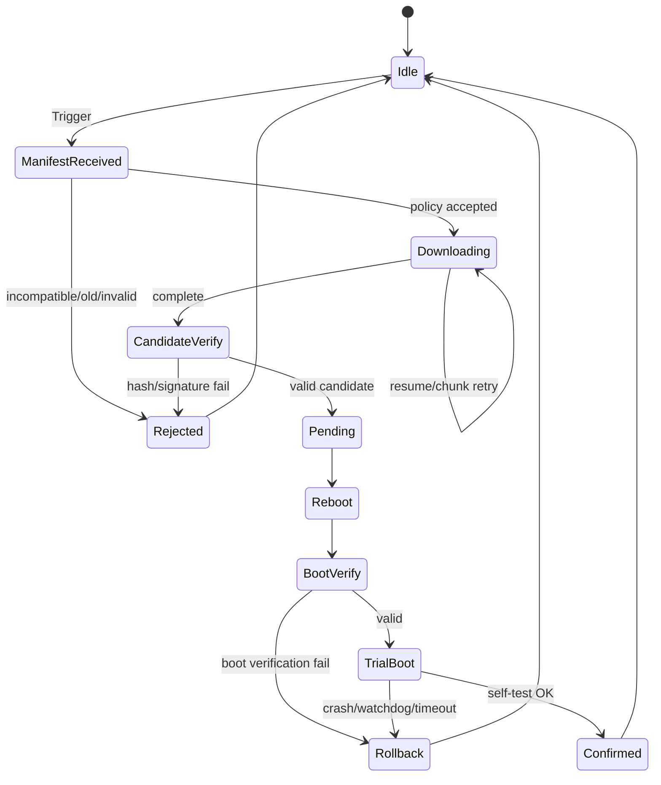

**确认条件不要只写“系统启动 30 秒”。** 企业设计建议把 Confirm Gate 定义成真正的健康条件，例如：

```text
Scheduler running
+ critical NVM readable
+ network stack basic operation
+ required peripheral self-test
+ configuration migration successful
+ safety subsystem initialized
```

否则一个“能启动但核心功能已坏”的 Firmware 会被永久确认。

### Bootloader ↔ Application API

推荐保持极小接口，而不是让 Bootloader 和 App 共享大量结构体：

```c
boot_state_t boot_get_state(void);
boot_slot_t  boot_get_running_slot(void);

int boot_request_upgrade(boot_slot_t candidate);
int boot_confirm_running_image(void);
int boot_mark_image_bad(void);

int boot_get_reset_reason(boot_reset_reason_t *reason);
int boot_get_image_info(boot_slot_t slot,
                        boot_image_info_t *info);

void boot_reboot_to_recovery(void);
```

逻辑职责：

| Application OTA Agent | Bootloader |
|---|---|
| HTTP/MQTT/BLE/CoAP | Flash geometry |
| DNS/TLS | Slot selection |
| Cloud auth | Image authentication |
| Download retry | Anti-rollback |
| Range/chunk resume | Swap/recovery |
| User policy | Jump |
| Telemetry | Minimal boot log |

这种边界最大的收益是 Bootloader 可以多年保持稳定。

### Metadata 要事务化

推荐 Boot State 使用 A/B metadata record：

```text
Record A:
    magic
    sequence = 41
    state
    candidate_slot
    boot_attempt
    CRC

Record B:
    magic
    sequence = 42
    state
    candidate_slot
    boot_attempt
    CRC
```

写入新状态时：

```text
写 inactive copy
→ verify readback
→ 最后写 commit marker
→ 下一次启动选择 CRC 正确且 sequence 最大者
```

不要依赖“一个 32-bit 状态字段一定原子”，除非 Flash datasheet 明确保证其编程原子性和掉电行为。

### 数据迁移与回滚

这是实际项目极容易遗漏的问题。

假设：

```text
Firmware v1 understands DB schema 4
Firmware v2 migrates DB -> schema 5
v2 subsequently crashes
Bootloader rolls back to v1
```

那么 A/B Firmware 虽然成功回滚，v1 却可能无法读取已经被 v2 单向升级的数据。

因此企业项目需要把：

```text
Firmware rollback
```

和

```text
Persistent data rollback / backward compatibility
```

一起设计。

推荐模式是至少在 Trial Boot 期间不要进行不可逆 migration；或者新的数据格式允许旧 Firmware 继续读取；再或者为 Configuration/DB 做自己的 transaction/versioning。

## 决策矩阵：个人项目与企业级项目

**关键结论：** “个人/企业”只是第二层分类，第一层仍应是**资源、断电风险、恢复成本、安全等级和设备规模**。对于 2026 年新设计，除极低资源产品外，普通联网 MCU 最值得默认采用的是 **A/B + Signature + First-Boot Confirm**；企业级再叠加 Secure Boot、Anti-rollback、HSM/PKI、Recovery、Fleet rollout 和完整故障注入测试。

### 按项目约束选择模式

评分含义：

```text
◎ = 很适合
○ = 可用
△ = 有明显代价
× = 不建议
```

| 约束 | 单镜像 | A/B | 外部 Staging | 差分+A/B | Network Boot | Staged Boot | A/B+Recovery |
|---|---:|---:|---:|---:|---:|---:|---:|
| Internal Flash 极小 | ◎ | × | ◎ | ○ | ◎ | ○ | × |
| RAM 极小 | ◎ | ◎ | ◎ | △ | △ | ○ | ○ |
| 经常掉电 | △ | ◎ | ○ | ◎ | △ | ◎ | ◎ |
| OTA 不能失败致砖 | × | ◎ | ○ | ◎ | △ | ○ | ◎ |
| 网络带宽昂贵 | ○ | ○ | ○ | ◎ | × | ○ | ○ |
| 无外部 Flash | ◎ | ○ | × | ○ | ◎ | ○ | △ |
| 有 QSPI/eMMC | ○ | ◎ | ◎ | ◎ | ○ | ◎ | ◎ |
| 高安全等级 | △ | ◎ | ◎ | ◎ | ○ | ◎ | ◎ |
| 开发周期很短 | ◎ | ◎* | ○ | × | △ | × | △ |
| 现场不可访问 | × | ◎ | ○ | ◎ | × | ◎ | ◎ |

`A/B*` 的前提是直接采用厂商/成熟开源实现，例如 ESP-IDF OTA 或 MCUboot，而不是重新自研完整 swap 状态机。ESP-IDF、MCUboot 的现成 rollback 状态机显著减少了项目自己解决 Power-fail consistency 的范围。citeturn21view0turn20view0

### 低资源典型配置

假设：

```text
512 KiB Flash
128 KiB RAM
无 external flash
BLE/UART
```

**个人项目建议：**

```text
首选：小 Bootloader + 单镜像 + UART/BLE Recovery + Signature
备选：如果 App < ~Flash/2，则 MCUboot A/B
```

若是可插 USB/J-Link 的自用设备，单镜像所带来的维护风险可能完全可以接受。

**企业项目建议：**

若“设备不可现场维护”同时仍只有 512 KiB，那么需求本身存在冲突。此时优先次序应该是：

```text
缩小 App / 增大 Flash
       ↓
争取 A/B
       ↓
若仍不行，增加低成本 external NOR
       ↓
external staging + robust recovery
```

而不是为了 BOM 省几角钱取消 recoverability。

### 中资源典型配置

假设：

```text
2 MiB internal Flash
512 KiB RAM
Wi-Fi/BLE
可选 QSPI
```

**个人项目首选：**

```text
Zephyr + MCUboot + MCUmgr
             或
ESP-IDF 原生 OTA
```

Zephyr MCUmgr 能通过 BLE、UDP、LoRaWAN、Serial 等 transport 管理 image；MCUboot 则完成 image authentication/slot management。citeturn22view0turn20view0

ESP32 平台则通常没必要为了“架构统一”而丢掉 ESP-IDF 成熟的 OTA/rollback/secure boot 体系。ESP-IDF 已把 OTA slot、首启验证与 anti-rollback 做成官方机制。citeturn21view0turn21view1

**企业项目首选：**

```text
A/B
+ hardware secure boot
+ signed image
+ security counter
+ watchdog rollback
+ HTTPS/MQTT control
+ release signing isolation
```

如果 Firmware 已接近 Flash 容量，再增加 QSPI external staging，而不是压缩 A/B safety margin。

### 高资源 Embedded Linux

假设：

```text
eMMC 4 GiB+
RAM 512 MiB+
Ethernet/Wi-Fi/LTE
```

推荐：

```text
ROM/SPL
  ↓
U-Boot Verified Boot
  ↓
RootFS A / RootFS B
  ↓
RAUC
```

或者：

```text
U-Boot
  ↓
A/B or Recovery
  ↓
SWUpdate
```

RAUC 原生采用 signed Bundle，并支持 A/B slot、Bootloader status、HTTP(S) streaming、watchdog-driven fallback 和 Adaptive Update。citeturn21view5turn21view6turn22view4

SWUpdate 则更“工具箱化”，支持多种 Flash/存储、Bootloader/kernel/rootfs/MCU firmware、自定义 handlers、delta update、AES artifact encryption、Yocto/Buildroot 等。citeturn21view7turn21view8

### 个人项目推荐组合

| 情形 | 推荐 Stack |
|---|---|
| STM32/nRF/通用 Cortex-M | MCUboot + 自己的 OTA Agent |
| Zephyr | MCUboot + MCUmgr |
| ESP32 | ESP-IDF OTA |
| Linux SBC | U-Boot + RAUC |
| 学习 Bootloader | 自写 Bootloader，但把它当实验，而不是生产安全实现 |

MCUboot 与 Zephyr 均使用 Apache-2.0；ESP-IDF 也是 Apache-2.0，因此对于闭源个人/商业 Firmware 通常更易于集成。citeturn22view6turn22view7turn17view4

### 企业项目推荐组合

对 MCU：

```text
ROM Trust Root
     ↓
MCUboot/vendor Secure Boot
     ↓
A/B Signed Application
     ↓
Trial Boot + Watchdog
     ↓
Confirm
```

发布端：

```text
Source
 ↓
CI Build
 ↓
Static/Test/HIL
 ↓
Unsigned Artifact
 ↓
Protected Release Job
 ↓
HSM/KMS Signing
 ↓
Manifest
 ↓
Artifact Repository/CDN
 ↓
Canary Cohort
 ↓
Fleet Rollout
```

对 Linux：

```text
SoC ROM
 ↓
Verified U-Boot
 ↓
A/B RootFS + Recovery
 ↓
RAUC/SWUpdate
 ↓
PKI/HSM
```

RAUC 对 PKCS#11/HSM 有直接官方支持；U-Boot Verified Boot 可以把可信 Public Key 固定于可信阶段；两者组合尤其适合构建明确的企业 Chain of Trust。citeturn22view3turn21view9

### 安全等级推荐

| Security Level | 推荐机制 |
|---|---|
| S0：开发板 | CRC/Hash + Recovery |
| S1：普通个人设备 | Signed Firmware + A/B |
| S2：消费 IoT | Secure Boot + Signed OTA + TLS + A/B |
| S3：企业/工业 | S2 + Anti-rollback + key separation + watchdog |
| S4：高价值设备 | S3 + HSM/KMS + device identity + Recovery + audit |
| S5：安全关键 | 还需对应行业认证、Threat Model、Fault Injection、安全生命周期 |

这里的 S0–S5 是本报告的项目分级方法，不是某个国际安全标准。

## 测试、CI/CD、安全威胁与开源合规

**关键结论：** OTA 的正确性不能靠“成功升级了 100 次”证明。真正有效的测试是主动在**每一个持久状态转换点**制造掉电、复位、Flash error 和错误镜像，然后证明设备最终只能进入“旧的已知良好版本、新的已确认版本或 Recovery”三种安全状态。企业项目还必须测试 CI signing pipeline，而不仅是 device code。

### 设计阶段应定义的不变量

建议把以下内容直接写进软件需求：

```text
Invariant A:
任何未通过可信签名验证的 Application 都不得获得执行权。

Invariant B:
发生任意单次掉电时，设备必须至少保留
1 个可信可启动镜像，或进入可信 Recovery。

Invariant C:
Candidate 未经过 First-Boot Health Check 前，
不得永久销毁 Last Known Good Image。

Invariant D:
security_counter < device_min_security_counter
的镜像永远不得启动。

Invariant E:
Transport authentication 失败不会改变 bootable slot。

Invariant F:
OTA metadata 损坏不能让 Bootloader 跳转到
partition bounds 之外。
```

这类 invariant 比“OTA 功能测试通过”更适合安全评审。

### 必测测试矩阵

| 类别 | 测试 |
|---|---|
| Image parsing | magic/header/length/TLV 超长、截断、溢出 |
| Signature | payload 改 1 bit、signature 改 1 bit、未知 key |
| Version | downgrade、security counter 边界、version wrap |
| Compatibility | 错 board ID、错误 HW rev、错误 Boot API |
| Download | 超时、重复 chunk、乱序、断点、服务器换文件 |
| Flash | erase fail、program fail、readback mismatch |
| Power | 每个 sector erase/write 后硬断电 |
| Swap | 每个 swap sub-state reset |
| First boot | crash、hang、watchdog、self-test fail |
| Confirm | Confirm 调用前/中/后 reset |
| Metadata | 单份损坏、双份 sequence 冲突、CRC fail |
| Rollback | v2 fail → v1；v1 数据兼容检查 |
| Recovery | A/B 均坏、network unavailable、USB recovery |
| Security | 重放旧镜像、伪造 manifest、非法巨大 image |
| Longevity | 多次升级 Flash wear、metadata wear |
| Multi-image | App/Radio/FPGA dependency mismatch |

MCUboot 将核心 Bootloader 行为分离到 `bootutil` 的原因之一就是使 Bootloader 能做单元测试；其代码库同时包含 simulator，非常适合把 Power-fail/state-machine 测试放入 Host CI，而不全部依赖实体板卡。citeturn20view0turn22view6

### Power-Cut 测试方法

生产级测试推荐自动化：

```text
for each OTA state:
    for N random offsets:
        start upgrade
        wait until target state / byte offset
        hardware-cut power
        restore power
        assert:
            signed boot only
            no infinite bootloop
            old or new valid image reachable
            metadata still parseable
```

更好的做法是通过 programmable power switch/relay 控制 DUT 电源，并从串口/JTAG/测试 GPIO 采集状态。

对于 MCUboot，应特别覆盖 image trailer 中所有 swap progress 状态，因为这正是其恢复中断交换事务的关键机制。citeturn20view0

### Fuzzing

Bootloader 的输入实际上是不可信的 binary parser：

```text
Image Header
TLV
Manifest
Partition metadata
Boot command packet
Recovery protocol
```

应进行：

```text
length overflow
integer overflow
unaligned field
duplicate TLV
unknown TLV
nested/oversized metadata
truncated signature
fake image_size
```

尤其不要在验证 `image_size <= slot_capacity` 之前用来自 Image Header 的长度执行 Flash read。

### CI/CD 推荐流程

个人项目可以相对简单：

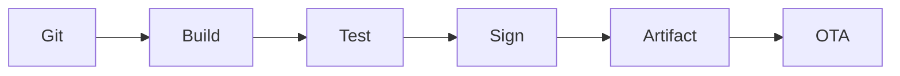

企业项目建议将 Build 和 Sign 隔离：


RAUC 对 PKCS#11 HSM/KMS 的直接支持说明这种隔离式 Signing Pipeline 并不只是理论设计。citeturn22view3

### GitHub Actions 风格 YAML 示例

以下是架构示例而非某个项目可直接运行的完整文件：

```yaml
name: firmware-release

on:
  push:
    tags:
      - "v*"

permissions:
  contents: read

jobs:
  build:
    runs-on: ubuntu-latest

    steps:
      - uses: actions/checkout@v4

      - name: Configure
        run: cmake -S . -B build -DCMAKE_BUILD_TYPE=Release

      - name: Build
        run: cmake --build build --parallel

      - name: Unit tests
        run: ctest --test-dir build --output-on-failure

      - name: Validate image size
        run: |
          python tools/check_image_size.py \
            build/application.bin \
            --max-size 0xB8000

      - name: Package unsigned image
        run: |
          python tools/make_manifest.py \
            --input build/application.bin \
            --board-id CTRL_A7 \
            --output build/unsigned-package

      - uses: actions/upload-artifact@v4
        with:
          name: unsigned-firmware
          path: build/unsigned-package

  sign:
    needs: build

    # Enterprise: protect this environment with approval rules.
    environment: production-signing

    runs-on: self-hosted

    steps:
      - uses: actions/download-artifact@v4
        with:
          name: unsigned-firmware

      - name: Sign using protected signing service
        run: |
          sign-cli firmware \
            --key-id production-firmware-key \
            --input unsigned-package/image.bin \
            --output signed-image.bin

      - name: Independent signature verification
        run: |
          verify-cli \
            --trusted-public-key production-public.pem \
            signed-image.bin

      - name: Generate release manifest
        run: |
          sha256sum signed-image.bin > SHA256SUMS
          python tools/release_manifest.py \
            --image signed-image.bin \
            --output release.json
```

企业实现中不要把长期生产私钥直接写成：

```yaml
env:
  PRIVATE_KEY: ${{ secrets.FW_PRIVATE_KEY }}
```

并长期暴露给通用 CI runner。更合理的是让 runner 只能请求 HSM/KMS 执行 signing operation，而私钥材料本身永不导出。RAUC 的 PKCS#11 模式正是这一类架构。citeturn22view3

### OTA 威胁模型与缓解

| 威胁 | 后果 | 主要缓解 |
|---|---|---|
| MITM 修改 Firmware | 执行恶意代码 | TLS + Firmware Signature |
| OTA Server 被攻破 | 恶意 Artifact 下发 | 离线/HSM Signing Key |
| Signing Key 泄露 | 攻击者可发布“合法”恶意 Firmware | HSM、key rotation、revocation strategy |
| 重放旧 Firmware | 恢复已修复漏洞 | Security Counter / eFuse |
| 修改 Boot Metadata | 强制异常 slot | Bootloader 边界验证、transactional state |
| Power loss | 半写 Flash | A/B、journal/trailer |
| 恶意 length/TLV | 越界读写/RCE | parser hardening/fuzzing |
| 恶意压缩包 | decompression bomb | decompressed-size hard limit |
| 错硬件 Firmware | 永久失效 | board/hw compatibility metadata |
| 新 Firmware bootloop | Fleet 大面积离线 | Trial Boot + watchdog + rollback |
| TLS key 泄露 | 伪装设备/服务器 | device-specific credentials/SE |
| Recovery 被滥用 | 绕过 Secure Boot | Recovery 仍必须签名验证 |
| CI compromise | 正常流程发布恶意 Image | build/sign separation + approval |
| Debug port | 读取密钥/改 Flash | 生产生命周期中按芯片能力锁定 |
| Flash readout | 固件/IP 泄露 | Flash encryption/read protection |

ESP-IDF 的 anti-rollback 将 Security Version 保存在 eFuse，并要求候选 Firmware 的版本不低于设备计数器，是硬件 monotonic state 的典型实现。citeturn21view1

U-Boot 官方也强调，如果攻击者能够替换用于验证签名的 Public Key，那么 Verified Boot 就失去了意义，因此可信公钥必须由只读或芯片安全机制保护。citeturn21view9

### TLS 与镜像签名的推荐验证顺序

```text
TLS authenticate server
        ↓
download signed Manifest
        ↓
verify Manifest signature
        ↓
check Board / Version / Security Counter / Size
        ↓
download payload
        ↓
verify payload digest
        ↓
verify Firmware signature
        ↓
mark candidate
        ↓
Bootloader independently verifies again
        ↓
trial boot
```

“Bootloader 独立再验证”并不是不必要的重复。Application 下载器本身属于可升级代码，未来可能有漏洞；Bootloader 验证构成最后的 trust boundary。

### 开源项目选择与许可证

| 项目 | 主要用途 | License | 设计评价 |
|---|---|---|---|
| MCUboot | MCU Secure Boot/A-B | Apache-2.0 | MCU 通用首选之一 |
| Zephyr | RTOS + MCUmgr | Apache-2.0 | 通用 MCU OTA 管理 |
| ESP-IDF | ESP SoC | Apache-2.0 | ESP 平台优先原生方案 |
| FreeRTOS | RTOS | MIT | 商业集成友好 |
| RAUC | Embedded Linux Update | LGPL-2.1-or-later | A/B、PKI、Streaming 强 |
| SWUpdate | Embedded Linux Update | GPLv2 | 功能非常广、集成需关注 copyleft |
| U-Boot | Linux/SoC Bootloader | GPL-2.0+ | Linux Boot/Verified Boot 基础设施 |

MCUboot、Zephyr 官方仓库均标为 Apache-2.0；ESP-IDF 为 Apache-2.0；FreeRTOS 仓库为 MIT。citeturn22view6turn22view7turn17view4turn17view5

RAUC 使用 LGPL-2.1-or-later；SWUpdate 主体是 GPLv2，其控制 library 为 LGPLv2.1，Lua extension 使用 MIT；U-Boot 源码使用 GPL-2.0+。citeturn22view8turn21view8turn22view9

对企业闭源 Firmware 来说，Apache-2.0/MIT 一般在集成方式上约束较少；GPL/LGPL 项目则应根据**是否修改项目本身、如何链接、如何分发设备/二进制、是否需要提供对应源码及许可证文本**做法务审查。不能仅凭“动态链接”或“进程间通信”一句话推断全部义务，最终应按实际软件架构和发行方式进行 OSS Compliance review；这部分不应视为法律意见。

### 项目选型的最终建议

对于一个当前参数全部“未指定”的新 MCU 项目，本报告给出的默认架构是：

```text
                    Cloud / Phone / PC
                           |
                    HTTPS / MQTT / BLE
                           |
                           v
                 +--------------------+
                 | Application        |
                 | OTA Agent          |
                 | Download / Resume  |
                 +---------+----------+
                           |
                           v
                 +--------------------+
                 | Inactive Slot B    |
                 | Signed Candidate   |
                 +---------+----------+
                           |
                         reboot
                           |
                           v
ROM Trust Root -> Bootloader
                   |
                   +--> HW compatibility
                   +--> Bounds
                   +--> Security counter
                   +--> Hash
                   +--> Signature
                   |
                   v
               Trial Boot
                   |
          +--------+---------+
          |                  |
      Self-test OK       Crash/Timeout
          |                  |
       Confirm            Rollback
          |                  |
          v                  v
      New LKG             Old LKG
```

其中：

```text
LKG = Last Known Good
```

对个人项目，可以删减为：

```text
A/B + 固定签名密钥 + HTTPS/BLE + 手工发布
```

对企业项目，则在相同设备端状态机上继续增加：

```text
Hardware Secure Boot
+ Anti-rollback
+ Production/Dev key separation
+ HSM/KMS
+ Recovery
+ Watchdog
+ Staged rollout
+ Fleet telemetry
+ SBOM/license compliance
+ automated power-cut testing
```

换言之，**企业级不是“写一个更复杂的 Bootloader”，而是让整个 Firmware 从源码、构建、签名、分发、首次启动、失败恢复到生命周期结束都处于可证明和可审计的状态。**

## 主要参考链接

**关键结论：** 以下优先列官方文档、规范和项目主页。除特别标识外，本次核心原始资料以英文为主；其中 MCUboot、ESP-IDF、Zephyr、RAUC、SWUpdate、U-Boot 文档直接覆盖了本报告大多数设计结论。

| 来源 | 语言 | 主要对应内容 |
|---|---|---|
| MCUboot Design | 英文 | 镜像、TLV、Swap、A/B、Rollback、RAM-load |
| Zephyr MCUmgr | 英文 | BLE/UDP/LoRaWAN/Serial OTA transport |
| ESP-IDF OTA | 英文 | ESP A/B、Rollback、Anti-rollback |
| ESP Secure Boot v2 | 英文 | ROM Trust Root、RSA-PSS、eFuse |
| FreeRTOS OTA | 英文 | HTTP/MQTT、Code Signing |
| U-Boot Verified Boot | 英文 | FIT Signature、Chain of Trust |
| RAUC | 英文 | Linux A/B、Streaming、PKI、Adaptive Update |
| SWUpdate | 英文 | Linux OTA、Delta、Recovery、多介质 |
| RFC 7252/7959 | 英文 | CoAP 与 Block Transfer |
| RFC 1350 | 英文 | TFTP |

**MCUboot**

[MCUboot 官方设计文档](https://docs.mcuboot.com/design.html) — 镜像 Header/TLV、Flash Map、Swap、Direct-XIP、RAM-load、Test/Confirm/Revert。citeturn20view0

[MCUboot GitHub](https://github.com/mcu-tools/mcuboot) — Apache-2.0，32-bit MCU Secure Boot 项目。citeturn22view6

**Zephyr / MCUmgr**

[Zephyr MCUmgr 官方文档](https://docs.zephyrproject.org/latest/services/device_mgmt/mcumgr.html) — Image Management、BLE、UDP、LoRaWAN、SPI 等 transport。citeturn22view0turn22view1turn22view2

[Zephyr GitHub](https://github.com/zephyrproject-rtos/zephyr) — Apache-2.0 RTOS。citeturn22view7

**Espressif ESP-IDF**

[ESP-IDF OTA 官方文档](https://docs.espressif.com/projects/esp-idf/en/stable/esp32/api-reference/system/ota.html) — OTA Partition、Application Rollback、Anti-rollback。citeturn20view2turn21view0turn21view1

[ESP32 Secure Boot v2 官方文档](https://docs.espressif.com/projects/esp-idf/en/stable/esp32/security/secure-boot-v2.html) — RSA-PSS、ROM → Second Stage → App、eFuse Trust Root。citeturn21view3turn21view4

[ESP-IDF GitHub](https://github.com/espressif/esp-idf) — Espressif 官方开发框架，Apache-2.0。citeturn17view4

**FreeRTOS / AWS IoT OTA**

[AWS FreeRTOS OTA Prerequisites](https://docs.aws.amazon.com/freertos/latest/userguide/ota-prereqs.html) — HTTP/MQTT OTA、S3、Code Signing Certificate 与权限配置。citeturn22view5

[FreeRTOS GitHub](https://github.com/FreeRTOS/FreeRTOS) — MIT License。citeturn17view5

**RAUC**

[RAUC Basics](https://rauc.readthedocs.io/en/latest/basic.html) — Bundle Signature、A/B Slot、HTTP Streaming、Bootloader integration。citeturn20view4turn21view5turn21view6

[RAUC Advanced](https://rauc.readthedocs.io/en/latest/advanced.html) — PKCS#11/HSM、HTTPS、Adaptive Update、block-hash-index。citeturn22view3turn22view4

[RAUC GitHub](https://github.com/rauc/rauc) — LGPL-2.1-or-later。citeturn22view8

**SWUpdate**

[SWUpdate 官方文档](https://sbabic.github.io/swupdate/) — Embedded Linux OTA、Bootloader integration、Signed Images。

[SWUpdate GitHub](https://github.com/sbabic/swupdate) — A/B/Atomic Update、librsync Delta、AES、Recovery、Yocto/Buildroot；GPLv2。citeturn21view7turn21view8

**U-Boot**

[U-Boot Verified Boot](https://docs.u-boot.org/en/latest/usage/fit/verified-boot.html) — FIT Signature、Public Key Trust、Chained Verification。citeturn20view7turn21view9

[U-Boot GitHub](https://github.com/u-boot/u-boot) — GPL-2.0+，嵌入式 Linux/SoC Bootloader。citeturn22view9

**IETF 协议规范**

[RFC 7252 — CoAP](https://www.rfc-editor.org/rfc/rfc7252.html) — 面向约束节点和低功耗/易丢包网络的协议设计，UDP/DTLS。citeturn16view0

[RFC 7959 — CoAP Block-Wise Transfers](https://www.rfc-editor.org/rfc/rfc7959.html) — Block1/Block2 大对象分块传输。citeturn17view0turn17view1

[RFC 1350 — TFTP](https://www.rfc-editor.org/rfc/rfc1350.html) — UDP 上的简单文件传输协议。citeturn17view2

**设计阶段最值得直接落入规格书的基线结论：**

> 新设计若资源允许，优先采用 **A/B + Signed Image + Trial Boot + Explicit Confirm + Automatic Rollback**；联网设备进一步使用 **TLS/DTLS**；高安全项目增加 **Hardware Secure Boot + monotonic Security Counter**；企业项目增加 **HSM/KMS Signing、独立 Recovery、Watchdog、分阶段发布、Fleet Telemetry、Power-cut Fault Injection 和 OSS Compliance**。MCU 侧优先复用 MCUboot/ESP-IDF 等成熟实现，Embedded Linux 侧优先评估 U-Boot + RAUC/SWUpdate，而不是重新实现已经被这些项目反复解决过的 Flash 事务与可信启动状态机。citeturn20view0turn21view0turn21view1turn21view6turn22view3