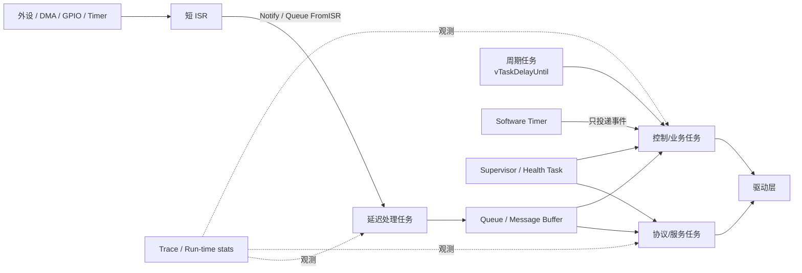
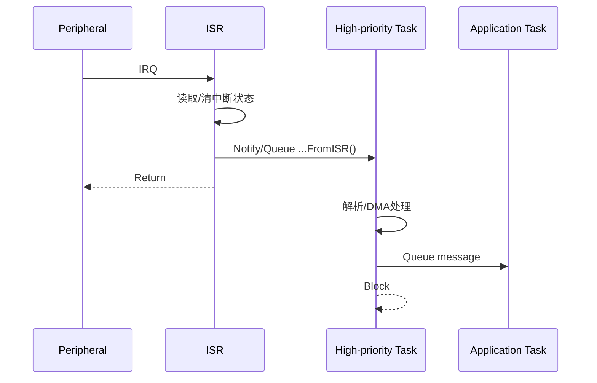
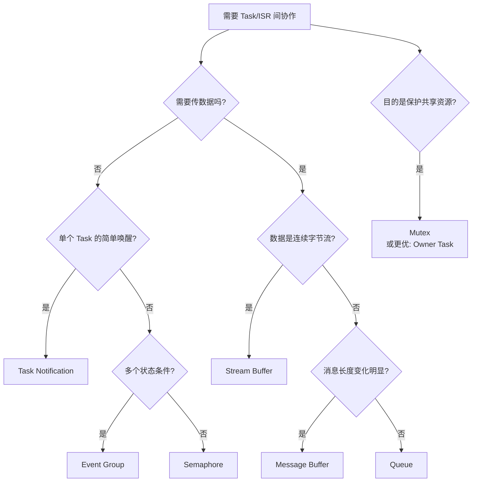

# 嵌入式系统中 FreeRTOS 功能设计模式分析报告

## 执行摘要

本报告面向 **FreeRTOS 系统架构设计阶段**，目标不是罗列 API，而是回答设计评审里更关键的问题：**什么时候应该增加一个任务、什么时候应该用队列而不是共享内存、ISR 应该做到什么程度、哪些对象应静态分配、怎样避免把“用了 RTOS”误当成“满足硬实时”、以及个人项目和企业级项目应该采取多严格的工程约束。**

先给出核心结论：

**第一，FreeRTOS 的首选架构不是“一个功能一个任务”，而是“一个独立调度需求/阻塞域/所有权域一个任务”。** 每增加一个任务，就增加独立栈、TCB、上下文切换和并发状态空间；因此任务拆分应围绕独立周期、不同实时优先级、会阻塞的 I/O、资源所有权和故障隔离，而不是按源文件或业务模块机械拆分。FreeRTOS 的调度可以采用抢占；`configUSE_TIME_SLICING=1` 时，相同优先级的 Ready 任务可在 tick 上轮转，而优先级数字越大代表更高任务优先级。citeturn8view2turn15search2

**第二，默认推荐“事件驱动 + 阻塞等待”，而不是周期轮询。** 数据流使用 Queue / Message Buffer / Stream Buffer；资源互斥用 Mutex；无数据状态同步用 Event Group；ISR 到单一任务的简单唤醒，优先考虑 Task Notification。`vTaskDelayUntil()` 更适合固定周期任务，因为它相对于绝对唤醒时刻运行，可避免简单 `vTaskDelay()` 带来的周期漂移。citeturn14search26turn14search20turn14search29

**第三，ISR 应尽可能短，把业务处理推迟到任务上下文。** 在 Cortex-M 上，允许调用 FreeRTOS `...FromISR()` API 的中断必须遵守端口的 `configMAX_SYSCALL_INTERRUPT_PRIORITY`/相关优先级约束；优先级高于该边界的中断不得调用这些 RTOS API。真正需要极低延迟的采样、PWM、捕获等路径，应尽量让 ISR 只完成寄存器读取、DMA 状态处理和任务通知。citeturn8view6turn14search29

**第四，内存策略决定系统长期可预测性。** FreeRTOS 同时支持静态与动态对象创建；`heap_1` 不释放、`heap_2` 可释放但不合并相邻空闲块、`heap_3` 包装 libc `malloc/free`、`heap_4` 会合并相邻空闲块、`heap_5` 在 `heap_4` 思路上支持多个非连续内存区。对于固定功能、长期运行或硬实时系统，优先静态分配，或者采用“启动阶段动态分配、进入运行态后禁止再分配”的折中方案。citeturn15search14turn9view0turn11view2turn10view1turn11view0turn11view4

**第五，FreeRTOS 是实时内核，但“使用 FreeRTOS”不等于“系统天然满足硬实时”。** 硬实时结论必须建立在 ISR 最大执行时间、临界区长度、最高优先级阻塞、Mutex 阻塞、任务 WCET、调度延迟、tick/硬件定时器精度和最坏通信路径都可界定并实际测量的基础上。调度机制只提供构造实时系统的工具，不替你证明 deadline。citeturn15search16turn15search8turn8view6

**第六，个人项目和企业项目最大的差异不应只是“代码量”，而是工程约束强度。** 个人项目可以接受 `heap_4`、较少的任务优先级层级以及简化的恢复策略；企业级项目则应把任务表、优先级表、栈预算、对象生命周期、错误策略、ISR 预算、超时策略、版本固定、Trace/运行统计和测试接口变成架构设计的一部分。FreeRTOS 官方 Kernel 仓库甚至明确建议依赖时固定到特定 tag 或 git hash，而不是长期跟随 `main`。citeturn18view0

本报告把 RAM/CPU 约束分为三档。**这不是 FreeRTOS 官方分级，而是设计评审用的工程尺度**：内存受限约指 16–64 KiB RAM 级、任务栈明显影响架构；中等约 64–512 KiB；充足约 512 KiB 以上或具有外部 RAM。最终仍应以 linker map、栈高水位、heap 最低余量和运行时测量为准。

推荐的通用架构如下：



这种结构把 **中断响应、数据搬运、业务处理、周期调度、健康管理和可观测性** 分开；对 Cortex-M、RP2040/RP2350、ESP32 类系统都具有较好的迁移性。FreeRTOS 官方 Kernel 将通用核心实现集中在 `tasks.c`、`queue.c`、`event_groups.c`、`stream_buffer.c`、`timers.c` 等文件，芯片/编译器相关实现位于 `portable/`，这本身就体现了这种分层。citeturn18view0


## 设计基线与任务模型

在进入具体 API 前，建议在设计评审阶段先形成一张任务表：

| 字段 | 设计阶段必须回答的问题 |
|---|---|
| Task Name | 为什么必须成为独立任务？ |
| Trigger | 周期、事件、IRQ、Queue、Notification？ |
| Period / Deadline | 周期和 deadline 分别是多少？ |
| Priority | 为什么高于/低于其他任务？ |
| WCET | 最坏执行时间估计及测量值？ |
| Stack | 初始预算、实测 high-water mark？ |
| Blocking | 等待哪些 Queue/Mutex/I/O？最大多久？ |
| Owner | 拥有哪些外设/状态/资源？ |
| Failure policy | 超时、错误、卡死后怎么办？ |
| Allocation | 静态还是动态？ |
| Trace ID | 如何在线定位调度问题？ |

### 任务模型模式卡

| 模式 | 适用场景与资源 | 实现要点 | 优点 / 缺点 / 常见陷阱 | 简洁片段 | 成熟案例 |
|---|---|---|---|---|---|
| **单应用任务 / Super-loop-in-task** | 简单传感器、控制器；RAM **低**，CPU/调度开销 **低** | FreeRTOS 中实际上仍有 Idle Task；这里的“单任务”是指一个主要应用任务。内部用状态机，不为每个功能建任务 | **优：**简单、RAM 最省、状态容易推理。**缺：**一个阻塞操作可拖住全部功能。**坑：**在循环里 busy wait | `for (;;) { step(); vTaskDelay(1); }` | [FreeRTOS Demo](https://github.com/FreeRTOS/FreeRTOS)、[pico-examples/freertos](https://github.com/raspberrypi/pico-examples/tree/master/freertos)、[arduino-esp32](https://github.com/espressif/arduino-esp32) |
| **固定优先级多任务** | 通信 + 控制 + UI/日志等独立调度域；RAM **中~高**，CPU **中** | 按 deadline / blocking domain 拆任务，而非按模块拆；保持优先级层级少且有依据 | **优：**响应性和模块隔离好。**缺：**每任务独立 stack，并发问题增加。**坑：**“功能越多任务越多”、无依据提高优先级 | `xTaskCreate(ctrl, "ctrl", ..., 4, ...);` | [FreeRTOS-Kernel/tasks.c](https://github.com/FreeRTOS/FreeRTOS-Kernel/blob/main/tasks.c)、[pico one/two core](https://github.com/raspberrypi/pico-examples/tree/master/freertos)、[ESP-IDF](https://github.com/espressif/esp-idf) |
| **固定周期任务** | 电机控制、传感器融合、健康检查；RAM **低~中**，CPU取决于周期 | 用 `vTaskDelayUntil()` 表达周期，不把业务执行时间累积到下一周期 | **优：**周期稳定。**缺：**过载时仍会 miss deadline。**坑：**用 `vTaskDelay(period)` 导致长期相位漂移 | `vTaskDelayUntil(&last, pdMS_TO_TICKS(10));` | FreeRTOS 官方 API、Pico FreeRTOS demos、ESP-IDF 周期任务 |
| **事件驱动 Worker** | 网络、串口协议、命令执行、存储；RAM **中**，空闲 CPU 很低 | Task 长期阻塞于 Queue/Notification；事件到达才运行 | **优：**省 CPU、响应明确。**缺：**需设计队列容量和背压。**坑：**使用 1 tick 轮询代替阻塞 | `xQueueReceive(q,&m,portMAX_DELAY);` | ESP-IDF OpenThread queue、Arduino Queue example、FreeRTOS `queue.c` |

FreeRTOS 的抢占、时间片和任务优先级是三个不同概念。`configUSE_PREEMPTION=1` 启用抢占；`configUSE_TIME_SLICING=1` 时，可在 tick 上让相同优先级 Ready 任务轮换。关闭时间片**不意味着同优先级任务永远不会发生切换**，其他阻塞/解阻塞或显式调度事件仍可能引起调度。设计硬实时任务时，不应依靠“时间片公平”来保证 deadline，而应尽量使关键任务拥有清晰的优先级关系。citeturn8view2

典型周期任务：

```c
static void ControlTask(void *arg)
{
    TickType_t next = xTaskGetTickCount();

    for (;;) {
        ReadSensors();
        RunControlLoop();
        UpdateActuator();

        vTaskDelayUntil(&next, pdMS_TO_TICKS(10));
    }
}
```

`vTaskDelayUntil()` 官方明确定位于需要保持固定执行频率的周期任务。citeturn14search26

**设计原则：任务的存在必须至少解决下面一个问题：独立 deadline、独立阻塞、独立资源所有权、独立故障恢复、或者必须使用独立优先级。** 否则优先考虑函数、状态机或事件处理器，而不是增加 Task。


## 同步、通信与内存设计模式

### 通信与同步模式总览

Queue、Semaphore、Mutex、Event Group、Message Buffer、Stream Buffer 不应互相替代。它们分别表达的是不同语义。

| 模式 | 主要语义 | RAM | CPU | ISR 成本 | 最适场景 |
|---|---|---:|---:|---:|---|
| Queue | 固定大小对象/命令传输 | 中 | 中；涉及对象复制 | 中 | producer-consumer |
| Binary Semaphore | 事件/计数同步 | 低 | 低~中 | 低 | 一次性事件同步 |
| Counting Semaphore | 数量型资源 | 低 | 低~中 | 低 | buffer slot、资源池 |
| Mutex | 共享资源所有权 | 低 | 低~中 | 不应作为 ISR primitive | I²C/SPI/共享设备 |
| Event Group | 多个布尔状态位 | 低 | 低 | 低~中 | READY/CONNECTED/FAULT |
| Message Buffer | 可变长度、保持消息边界 | 中 | 中 | 中 | 协议帧 |
| Stream Buffer | 连续字节流 | 中 | 低~中 | 中 | UART/ADC/DMA 字节流 |
| Task Notification | Task 定向事件/计数 | 极低 | 极低 | 极低 | ISR→单个 Task 唤醒 |

其中 Queue、Event Group、Stream Buffer 等均是 FreeRTOS Kernel 的独立核心实现；FreeRTOS Kernel 仓库直接包含 `queue.c`、`event_groups.c`、`stream_buffer.c`。citeturn18view0

**Queue——Producer/Consumer 模式。**  
适合“发送的不只是事件，而且携带有意义的数据或命令”。设计时优先传小型值对象：

```c
typedef struct {
    uint16_t id;
    int32_t  value;
} SensorMsg;

xQueueSend(sensor_q, &msg, pdMS_TO_TICKS(5));
```

RAM 主要受 **队列深度 × item size** 影响，因此不要把几 KiB 的 payload 直接复制进 Queue；大数据更适合传固定内存池的索引/描述符。Queue 的主要优点是天然形成 producer/consumer 边界，并允许消费者阻塞；主要陷阱是容量凭感觉设置、满队列时悄悄丢包以及高频大对象复制。成熟案例可看 [FreeRTOS-Kernel/queue.c](https://github.com/FreeRTOS/FreeRTOS-Kernel/blob/main/queue.c)、[ESP-IDF `esp_openthread_task_queue.c`](https://github.com/espressif/esp-idf/blob/master/components/openthread/src/esp_openthread_task_queue.c) 和 [Arduino-ESP32 Queue 示例](https://github.com/espressif/arduino-esp32/tree/master/libraries/ESP32/examples/FreeRTOS/Queue)。ESP-IDF 是 Espressif 官方框架，仓库目前已有逾 5 万次提交，包含独立的 `components`、`examples`、测试和配置体系，适合作为企业级实现参考。citeturn18view1

**Semaphore / Mutex——同步与所有权模式。**  
Binary Semaphore 应表达“发生了一件事”；Counting Semaphore 应表达“还有 N 个资源”；Mutex 则表达“这个资源当前由哪个 Task 独占”。不要因为 API 看起来类似，就用 Binary Semaphore 当通用锁。共享 I²C/SPI、文件系统、全局协议上下文适合 Mutex，但更好的架构往往是把外设交给一个 owner task，通过 Queue 发请求，从根本上减少共享状态。

```c
if (xSemaphoreTake(i2c_mutex, pdMS_TO_TICKS(20)) == pdTRUE) {
    I2C_Transaction();
    xSemaphoreGive(i2c_mutex);
}
```

关键陷阱有两个：一是 **持锁期间调用可能长期阻塞的函数**；二是形成 A→B、B→A 的锁顺序反转。硬实时系统即使使用支持优先级继承的 Mutex，也仍须把最大阻塞时间计入响应时间分析；优先级继承减少某类 priority inversion，并不会消除所有阻塞。FreeRTOS 的 semaphore/mutex 实现在 Queue 内核代码体系中；案例可参考 [FreeRTOS `queue.c`](https://github.com/FreeRTOS/FreeRTOS-Kernel/blob/main/queue.c)、[Arduino Mutex](https://github.com/espressif/arduino-esp32/tree/master/libraries/ESP32/examples/FreeRTOS/Mutex) 与 [Arduino Semaphore](https://github.com/espressif/arduino-esp32/tree/master/libraries/ESP32/examples/FreeRTOS/Semaphore)。citeturn18view0turn19view2

**Event Group——状态位/Barrier 模式。**  
最适合多个布尔条件，例如：

```c
#define WIFI_OK     BIT0
#define TIME_OK     BIT1
#define STORAGE_OK  BIT2

EventBits_t b = xEventGroupWaitBits(
    sys_events,
    WIFI_OK | TIME_OK,
    pdFALSE,
    pdTRUE,            // 两个条件都满足
    pdMS_TO_TICKS(5000)
);
```

Event Group 的优势是“同时等待多个状态”表达非常清楚；设置 bit 会解除满足条件的等待任务。陷阱是把 Event Group 当作数据通道：bit 只能表示状态，不能携带事件次数或 payload；某个 bit 被多处同时当“瞬时事件”使用，也容易产生语义混乱。citeturn14search20

成熟案例包括 [FreeRTOS `event_groups.c`](https://github.com/FreeRTOS/FreeRTOS-Kernel/blob/main/event_groups.c)、[Arduino-ESP32 `HttpsOTAUpdate.cpp`](https://github.com/espressif/arduino-esp32/blob/master/libraries/Update/src/HttpsOTAUpdate.cpp)，以及 ESP-IDF 本身内置的 FreeRTOS Event Group 实现与系统组件。citeturn18view0turn18view1

**Message Buffer——变长报文模式。**  
适合 UART 协议帧、RPC、TLV 消息或长度变化明显的数据。与普通 Queue 相比，它不要求每个 slot 是相同 item size：

```c
size_t n = xMessageBufferSend(
    mb,
    packet,
    packet_len,
    pdMS_TO_TICKS(10)
);
```

优势是保留“消息”边界且减少为了最大包长而固定预留 slot 的浪费；缺点是仍涉及 buffer 空间管理和数据复制，并且需要规划最大消息长度与 buffer 峰值占用。FreeRTOS Message Buffer 建立在 Stream Buffer 实现之上，核心代码位于 [FreeRTOS `stream_buffer.c`](https://github.com/FreeRTOS/FreeRTOS-Kernel/blob/main/stream_buffer.c)；可结合 [ESP-IDF](https://github.com/espressif/esp-idf) 和 [pico-examples FreeRTOS networking](https://github.com/raspberrypi/pico-examples/tree/master/pico_w/wifi/freertos) 的协议任务结构参考。官方 API 也提供 ISR-safe 的 Message Buffer 发送形式。citeturn6search7turn18view0

**Stream Buffer——连续字节流模式。**  
UART RX/TX、连续 ADC 数据、调制解调器串口和 DMA 数据路径尤其适合：

```c
uint8_t buf[64];
size_t n = xStreamBufferReceive(
    rx_stream, buf, sizeof(buf), portMAX_DELAY
);
```

Message Buffer 强调完整消息；Stream Buffer 强调字节序列。FreeRTOS 的这类 buffer 针对典型单发送者/单接收者路径进行了简化设计；若引入多个 writer/readers，应由调用方增加串行化，或者换成 Queue/集中 owner task。资源占用主要由用户设定的 buffer 容量决定。核心实现同样见 [`stream_buffer.c`](https://github.com/FreeRTOS/FreeRTOS-Kernel/blob/main/stream_buffer.c)。citeturn18view0

**Task Notification——轻量直接通知模式。**  
虽然用户要求的通信原语列表中没有它，但在设计评审里应明确考虑，因为它非常适合 **ISR → 单个任务** 或 **Task → 单个 Task** 的“一对一唤醒/计数”。官方提供 `vTaskNotifyGiveFromISR()`。citeturn14search29

```c
void ADC_IRQHandler(void)
{
    BaseType_t wake = pdFALSE;

    ClearAdcIrq();
    vTaskNotifyGiveFromISR(adc_task, &wake);

    portYIELD_FROM_ISR(wake);
}

/* Task */
for (;;) {
    ulTaskNotifyTake(pdTRUE, portMAX_DELAY);
    ProcessAdcBlock();
}
```

资源开销通常低于为了单一通知额外创建 Queue/Semaphore，但它的限制也很明显：通信对象直接绑定 Task，可复用性和多消费者语义较弱。因此企业项目应把 Task Notification 封装在模块接口之后，而不是让全系统到处持有 `TaskHandle_t`。

### 内存管理模式

FreeRTOS 支持静态与动态对象创建，例如 Task、Queue、Semaphore、Software Timer 均可采用预分配 RAM。citeturn15search14turn8view4

| 策略 | 特征 | 推荐场景 | 主要风险 |
|---|---|---|---|
| **全静态** | Stack/TCB/Queue storage 均预分配 | 硬实时、长期无人值守、功能固定、企业安全关键系统 | 配置工作更多；RAM 无法弹性复用 |
| **启动时动态，运行后冻结** | 初始化阶段 `xTaskCreate` 等，业务期禁止创建删除 | **企业通用首选折中** | 需要架构纪律和封装 |
| **运行期动态** | 按场景创建/删除对象 | 个人项目、插件式业务、连接动态变化 | 碎片、OOM、失败路径复杂 |
| **对象池** | 固定块复用 | 高吞吐通信、大 buffer、硬实时数据通道 | 需自行设计 ownership |

Heap 实现的选择：

| Heap | FreeRTOS 源码行为 | 设计判断 |
|---|---|---|
| `heap_1` | 可分配，不能 `free` | 启动阶段一次性创建全部对象时极简单、确定性高 |
| `heap_2` | 支持释放，但不合并相邻空闲块 | 容易碎片化；新项目通常没有优先选它的理由 |
| `heap_3` | 包装工具链 `malloc/free` | 行为受 libc/平台 allocator 影响，不宜未经验证用于实时路径 |
| `heap_4` | 支持释放并合并相邻空闲区 | **一般动态分配场景首选** |
| `heap_5` | 类似 `heap_4`，但可跨多个非连续 RAM region | 多 SRAM bank / 特殊 memory map |

这些差异直接来自 FreeRTOS 官方内存管理实现。citeturn9view0turn11view2turn10view1turn11view0turn11view4

静态对象的典型形式：

```c
static StaticTask_t control_tcb;
static StackType_t control_stack[512];

TaskHandle_t h = xTaskCreateStatic(
    ControlTask,
    "ctrl",
    512,
    NULL,
    4,
    control_stack,
    &control_tcb
);
```

需要特别注意：FreeRTOS 许多 stack-size 参数以 **`StackType_t` 的数量而非字节数** 表达，不能把“512”机械理解为 512 Byte；实际语义需要看对应 API/port。citeturn8view2

对于企业级项目，更推荐：

```text
Boot
  ↓
硬件与 BSP 初始化
  ↓
创建所有长期任务 / Queue / Mutex / Buffer
  ↓
检查全部创建结果
  ↓
记录初始 heap / stack 状态
  ↓
进入 RUN 状态
  ↓
禁止普通业务代码创建长期 RTOS 对象
```

这样仍然能保留 `heap_4` 的工程便利，又把运行期 allocator 不确定性显著压缩。


## 中断、定时、低功耗与性能延迟

**ISR 延迟处理模式**是 FreeRTOS 设计中价值最高的模式之一：



Cortex-M 中尤其要把 **硬件 NVIC 优先级** 与 FreeRTOS 的 syscall interrupt priority 规则纳入设计。`configMAX_SYSCALL_INTERRUPT_PRIORITY` 定义了能够调用 RTOS API 的中断边界；高于该边界的高优先级中断可以保持对内核临界区的低干扰，但不得调用 FreeRTOS API。不同端口的优先级表示法必须以该 port 文档和 `FreeRTOSConfig.h` 为准。citeturn8view6

推荐把 ISR 分成三类：

| ISR 类型 | 设计方式 |
|---|---|
| 极硬实时、μs 级 | 不调用 RTOS；直接处理最小硬件动作，必要时 DMA |
| 普通实时 ISR | `...FromISR()` 唤醒高优先级 deferred-handler task |
| 低速事件 | Queue/Event/Notification 给普通任务 |

**错误模式**是“ISR 里完成整个协议包解析、printf、flash 写入甚至阻塞式驱动调用”。这会增加所有低优先级中断和任务的最坏响应延迟。

成熟案例应重点读 [FreeRTOS `portable/`](https://github.com/FreeRTOS/FreeRTOS-Kernel/tree/main/portable)、[ESP-IDF components/drivers](https://github.com/espressif/esp-idf/tree/master/components) 和 [pico-examples](https://github.com/raspberrypi/pico-examples)。Raspberry Pi 官方例程当前明确提供 FreeRTOS 单核、双核和静态分配示例，也有 FreeRTOS + lwIP/Wi-Fi 的完整集成案例。citeturn19view0

**软件定时器模式。** Software Timer 非常适合“到了某时间点发一个事件”，不适合承担长时间业务：

```c
static void HeartbeatTimer(TimerHandle_t t)
{
    const AppEvent e = EVT_HEARTBEAT;
    xQueueSend(app_q, &e, 0);       // 回调只投递事件
}
```

FreeRTOS 软件定时器由 timer service/daemon 机制管理，对应核心实现 [`timers.c`](https://github.com/FreeRTOS/FreeRTOS-Kernel/blob/main/timers.c)。多个 Timer callback 共享这一服务上下文，因此回调中执行长算法或长时间阻塞，会影响其他 software timer 的处理；设计上应把 callback 当作“事件产生器”，把实质工作交给 Task。citeturn18view0turn20view0

定时功能应这样选：

| 需求 | 首选 |
|---|---|
| 1 kHz / 10 kHz 精密控制 | 硬件 Timer/ADC/PWM + ISR/DMA |
| 1–100 ms 周期业务 Task | `vTaskDelayUntil()` |
| 多个非严格超时事件 | Software Timer |
| 协议超时 | Queue receive timeout / Software Timer |
| 秒级维护任务 | 周期低优先级 Task |
| 高精度 timestamp | 芯片硬件 counter，而不是 RTOS tick |

FreeRTOS 的时间基础通常依赖 tick，因此 RTOS timeout 的分辨率受到 `configTICK_RATE_HZ` 限制。增加 tick rate 会改善 tick 级粒度，但也意味着更频繁的 tick ISR，不能把提高 `configTICK_RATE_HZ` 当作“免费提高实时性”。citeturn15search8turn8view2

**Tickless Idle / 低功耗模式。** `configUSE_TICKLESS_IDLE=1` 可让支持该机制的 port 在较长 idle 区间抑制周期 tick，进入低功耗状态；并非所有 port 的低功耗实现完全相同。citeturn8view3

推荐结构：

```text
所有任务 Blocking
       ↓
Idle 判断下一次唤醒时间
       ↓
预计 idle 足够长？
   ┌───┴────┐
  否       是
  ↓        ↓
普通 idle  Tickless / MCU sleep
             ↓
      RTC/IRQ/Timer 唤醒
             ↓
         校正 tick
```

Tickless 的常见陷阱不是 FreeRTOS 本身，而是外围设备：UART DMA、RTC、外部 flash、debugger、clock tree、无线协议栈可能限制可进入的 sleep state。因此企业产品要把“FreeRTOS tickless”和“芯片 PM framework”分开评审。

### 性能与延迟分析

设计阶段不要只问“CPU 占用多少”，建议建立下面的响应链：

\[
R_{event} =
T_{IRQ\_mask}
+T_{higher\_ISR}
+T_{ISR}
+T_{sched}
+T_{higher\_tasks}
+T_{handler}
\]

其中任何一项没有上界，都不能声称路径是硬实时。

应至少测量：

| 指标 | 为什么重要 |
|---|---|
| ISR max duration | 直接影响中断响应 |
| longest critical section | 影响 scheduler/IRQ latency |
| task WCET | deadline 分析基础 |
| queue max depth | 判断生产/消费速率是否失配 |
| task stack high-water mark | 防止隐藏 stack 浪费/溢出 |
| minimum free heap | 动态内存风险 |
| context-switch rate | 判断任务/事件拆分是否过细 |
| CPU runtime per task | 定位热点和 starvation |

FreeRTOS 可选择性收集各任务运行时间统计；`configGENERATE_RUN_TIME_STATS` 用于运行统计，而 `configUSE_TRACE_FACILITY` 会在任务/内核数据中增加 trace 工具需要的信息。citeturn15search18turn8view0

因此“Trace 开关没有代价”是错误的：它会引入额外代码/数据和观测开销。**开发版应打开足够观测能力，量产版则按故障诊断要求选择保留程度。**


## 健壮性、安全、测试、追踪与可维护性

FreeRTOS 的健壮性不应该依赖“出错就 `while(1)`”。建议把错误分为 **编程错误、资源耗尽、外设错误、协议错误、暂态错误和不可恢复错误**。

**推荐的错误分层：**

```text
                         Error
                           |
        ┌──────────────────┼──────────────────┐
        |                  |                  |
    Programming         Recoverable        Fatal
    invariant            runtime           system
        |                  |                  |
 configASSERT          timeout/retry     persist fault
 stack check           reinit module     safe state
 unit tests            circuit breaker   watchdog/reset
```

`configASSERT()` 可以在开发时捕获内部不变量错误；FreeRTOS 允许应用自行定义 assert 行为。`configCHECK_FOR_STACK_OVERFLOW` 提供栈溢出检测，其中不同级别使用不同检查策略；`configUSE_MALLOC_FAILED_HOOK` 可让动态分配失败进入应用 hook。citeturn8view1turn8view6turn8view7

企业项目至少建议具有：

```c
#define configASSERT(x) \
    do { \
        if (!(x)) { \
            Fault_Record(__FILE__, __LINE__); \
            taskDISABLE_INTERRUPTS(); \
            System_SafeReset(); \
        } \
    } while (0)

#define configCHECK_FOR_STACK_OVERFLOW 2
#define configUSE_MALLOC_FAILED_HOOK   1
```

这里的 `System_SafeReset()` 只是架构占位符；真实产品必须按安全需求决定“复位、降级、安全状态还是继续运行”。

**Supervisor / Health Monitor 模式**比“每个任务自己处理自己的一切”更适合企业项目。各关键任务周期性更新 heartbeat，Supervisor 检查：

```c
if (now - health.comm_last_seen > COMM_DEADLINE) {
    Fault_Report(FAULT_COMM_STALLED);
}
```

但要注意：如果 heartbeat 只是无脑地在任务循环第一行更新，那么一个“业务逻辑已经失效、循环仍在跑”的任务仍会被误判为健康。Heartbeat 应放在完成关键事务之后。

**Stack Protection。** `configCHECK_FOR_STACK_OVERFLOW=2` 很适合测试与调试，但它不是 MPU 意义上的完整内存隔离。对具有 Memory Protection Unit 的 Cortex-M port，FreeRTOS 提供 MPU 相关的 task region/privilege 机制；资源隔离需要硬件 MPU 和相应 FreeRTOS port 支持，而不是简单打开一个通用宏。citeturn0search2turn8view7

因此安全性应分层理解：

| 层次 | FreeRTOS 设计手段 | 不能解决的问题 |
|---|---|---|
| 栈错误检测 | Stack overflow hook | 任意内存越界的全部情况 |
| Heap 健壮性 | heap 检查、失败 hook；部分 heap 实现支持 protector | 完整进程隔离 |
| API ownership | Task owner + Queue | 恶意内存访问 |
| MPU | privileged/unprivileged task + memory region | SoC 外设安全全部问题 |
| Secure Boot / OTA | RTOS 之外的平台安全机制 | 运行时逻辑隔离 |

当前 FreeRTOS 配置还提供针对部分 heap 实现的 `configENABLE_HEAP_PROTECTOR` 等保护能力，但这类机制应视为 allocator hardening，而不能代替 MPU/TrustZone/安全启动等系统安全设计。citeturn8view5

**Trace / Debug 模式。** 推荐开发版：

```c
#define configUSE_TRACE_FACILITY              1
#define configGENERATE_RUN_TIME_STATS          1
#define configCHECK_FOR_STACK_OVERFLOW         2
#define configUSE_MALLOC_FAILED_HOOK           1
#define configQUEUE_REGISTRY_SIZE             16
```

Queue registry 可以给 Queue 等内核对象赋可读名字，便于调试工具显示。citeturn14search7

ESP-IDF 是值得直接研究的追踪案例，其仓库包含系统 tracing 示例，并维护 FreeRTOS SystemView 相关配置，例如：

- [`examples/system/tracing/esp_trace_custom_library`](https://github.com/espressif/esp-idf/tree/master/examples/system/tracing/esp_trace_custom_library)
- [`docs/en/api-guides/SYSVIEW_FreeRTOS.txt`](https://github.com/espressif/esp-idf/blob/master/docs/en/api-guides/SYSVIEW_FreeRTOS.txt)

ESP-IDF 仓库本身同时具有 `components/`、`examples/`、`tools/`、`pytest.ini`、pre-commit 配置等工程设施，说明成熟 RTOS 项目并不把“FreeRTOS API 使用正确”视作质量终点，而是把测试、静态检查、配置和工具链一起管理。citeturn18view1

**可测试性方面，建议把业务代码与 FreeRTOS API 隔开：**

```c
/* Bad: 业务模块直接依赖 QueueHandle_t */
void Sensor_Process(QueueHandle_t q);

/* Better */
typedef struct {
    bool (*publish)(const SensorData *d);
    uint32_t (*time_ms)(void);
} SensorPort;

void Sensor_Process(const SensorPort *port);
```

这样 host unit test 不需要真正跑 MCU scheduler。需要测试 Task/Queue 行为时，则可进一步在 FreeRTOS host/模拟 port 上做集成测试；FreeRTOS Kernel 官方 CMake 示例甚至明确提供 `GCC_POSIX` native port 选择方式。citeturn18view0

但 host 测试不能证明 MCU 上的真实 ISR latency、cache/flash wait state、DMA contention 或 WCET，因此必须保留 target-in-loop 测试。

**可维护性的核心建议是建立一层窄的 OS abstraction，但不要重新发明一个完整 RTOS。** 例如：

```c
os_event_send()
os_mutex_lock()
os_thread_create()
os_time_ms()
```

把业务层与 `xQueueSend()` 等具体 API 解耦即可。过度抽象会掩盖 Queue/Event/Mutex 不同语义，反而使实时行为难以审查。

FreeRTOS 的可移植性来自通用 kernel 与 `portable/` 的分离；FreeRTOS Kernel 官方仓库目前包含多种 port，并把通用文件和架构相关文件明确分开。citeturn18view0


## 个人项目与企业级项目的设计分界

个人项目与企业级项目**不应该使用两套完全不同的 FreeRTOS**；真正不同的是容错、可证明性、升级治理和维护周期。

| 维度 | 个人项目推荐 | 企业级项目推荐 |
|---|---|---|
| 任务数量 | 够用即可，3–8 个常较合理 | 每个任务必须有设计理由、owner、WCET/stack/blocking 记录 |
| 优先级 | 2–4 层即可 | 建立正式 priority table，禁止随意“+1” |
| 内存 | `heap_4` 通常足够 | 静态或 startup-only dynamic；关键路径禁止运行期分配 |
| Queue | 按经验给容量并测试 | 基于生产/消费最坏 burst 推导容量 |
| ISR | 短 ISR + Notification | ISR budget、API priority rule、worst latency 都需审查 |
| Mutex | 简单共享设备可接受 | 优先 owner-task；锁顺序、最大持锁时间必须可审计 |
| Timer | 回调做简单工作问题不大 | callback 只产生事件，复杂处理进入 task |
| Error | log + retry/reset | 错误分类、降级、安全状态、故障持久化 |
| Stack | 给较大余量 | 初始分析 + high-water 实测 + margin policy |
| Assert | 开发版打开 | CI/Debug 必开；Release 转为受控 fault handling |
| Trace | 出问题再开 | 设计阶段即定义关键 trace point |
| Watchdog | 可选 | 独立 health/supervisor 策略 |
| MPU | 通常不必 | 有安全/故障隔离要求时评估 |
| 测试 | 板上功能测试 | host unit + integration + HIL + timing regression |
| FreeRTOS 版本 | 跟 SDK 即可 | pin tag/hash；升级做变更分析 |
| 配置 | 一个 `FreeRTOSConfig.h` | 配置纳入版本控制、评审和产品 variant 管理 |

FreeRTOS 官方 Kernel 仓库明确建议使用具体 git hash 或 tagged version，而不是将生产依赖永久指向 `main`，这对企业级供应链和可复现构建尤其重要。citeturn18view0

### 个人项目的推荐“默认配方”

典型 Cortex-M/ESP32 个人设备：

```text
Task:
  Sensor Task       priority 3
  Communication     priority 2
  Application       priority 2
  Logger            priority 1

IPC:
  Sensor -> App     Queue
  ISR -> Sensor     Task Notification
  Status            Event Group

Memory:
  heap_4
  启动阶段创建大部分对象

Protection:
  configASSERT
  stack overflow level 2
  malloc failed hook
```

对于 Arduino/ESP32 类快速原型，`arduino-esp32` 是很好的模式参考：该项目截至当前 GitHub 页面约有 **17.4k stars**，其 FreeRTOS Queue、Mutex、Semaphore 示例非常适合快速理解基本模式。citeturn19view2

但要注意：**项目流行或 API 简单并不能证明架构满足产品级实时性。** 从个人原型转成量产产品时，通常需要重新检查任务栈、错误路径、资源所有权、动态分配、时序和升级策略。

### 企业级项目的推荐“默认配方”

```text
IRQ layer
    ↓
Deferred ISR Tasks
    ↓
Driver/Service Owner Tasks
    ↓
Domain Logic
    ↓
Communication / Storage / Diagnostics
          ↑
      Supervisor
```

企业项目建议明确规定：

> **Rule A：** ISR 不运行业务状态机。  
> **Rule B：** 每个共享外设只有一个 owner，除非有充分理由使用 Mutex。  
> **Rule C：** 硬实时路径不得依赖运行期 heap 分配。  
> **Rule D：** 所有阻塞必须有语义明确的 timeout 或明确说明为什么可 `portMAX_DELAY`。  
> **Rule E：** 所有 Task 有 stack budget 和 high-water 实测记录。  
> **Rule F：** 每个 priority 都有架构理由。  
> **Rule G：** Software Timer callback 不做慢 I/O。  
> **Rule H：** watchdog 不由单一可能卡死的 task 自己证明自己“健康”。  
> **Rule I：** FreeRTOS/SDK 固定版本，升级经过 timing 和 regression 测试。  
> **Rule J：** Release build 仍保留最低程度的 fault code、reset reason 与持久化诊断。

作为企业级案例，ESP-IDF 的价值远高于单个 API 示例：其官方仓库包含组件化架构、版本支持策略、兼容性声明、示例、测试和工具体系，并明确针对不同 SoC/release 维护文档。citeturn18view1


## 决策矩阵与一页式快速参考

### 三维决策矩阵

以下矩阵把 **内存、实时性、复杂度** 同时纳入。这里“硬实时”指存在不可违反 deadline 的路径，而不是简单理解为“需要比较快”。

| RAM | 实时性 | 复杂度 | 推荐架构 | IPC / 内存 | 重点约束 |
|---|---|---|---|---|---|
| **受限** | 无 | 简单 | 单应用 Task / 状态机 | 少量 Queue；static / heap_1 | 不要按功能拆 Task |
| **受限** | 软 | 简单 | 2–3 个 event-driven Task | Notify + Queue | 控制 task stack |
| **受限** | 硬 | 简单 | 高优先级周期 Task + 极短 ISR | Static + Notify | 禁止运行期 alloc；测 WCET |
| **受限** | 软 | 中等 | Owner Task + Queue | Queue/Stream Buffer | 减少 Mutex |
| **受限** | 硬 | 中等 | 固定优先级、极少任务 | Static + fixed queue | 明确所有 blocking bound |
| **中等** | 无 | 中等 | 多任务事件驱动 | heap_4 + Queue/Event | 优先可维护性 |
| **中等** | 软 | 中等 | Service Tasks + Queue/Event | heap_4/startup alloc | 推荐默认产品架构 |
| **中等** | 硬 | 中等 | fixed-priority + static critical path | Static + Notify/Queue | timing trace + response analysis |
| **中等** | 软 | 复杂 | 分层 services + supervisor | Queue/Message/Stream/Event | 监控 queue depth/stack |
| **中等** | 硬 | 复杂 | partitioned service + critical tasks | 关键 static，非关键可 dynamic | priority inversion / ISR budget |
| **充足** | 无 | 复杂 | service/task 分层 | heap_4 + rich IPC | 不要因 RAM 多而过度建 Task |
| **充足** | 软 | 复杂 | service + supervisor + tracing | Queue/Event/Message | 可观测性优先 |
| **充足** | 硬 | 复杂 | critical path isolation + MPU 可选 | Critical static；MPU | RAM 足也不能放弃确定性 |

硬实时的推荐不随 RAM 充裕程度而改变：**RAM 越多只意味着你有更多设计选择，不意味着动态内存或大量 Task 自动变得实时安全。**

### IPC 选择决策



### 一页式快速参考

| 模式 | 关键特征 | 何时使用 | 尽量不要用于 |
|---|---|---|---|
| 单应用 Task | 最低 RAM、最低并发复杂度 | 小控制器、简单产品 | 大量阻塞 I/O |
| Fixed-priority Tasks | deadline/阻塞域隔离 | 大多数中型产品 | “一个函数一个 Task” |
| `vTaskDelayUntil` | 固定周期 | control/sensor loop | 精密 μs 定时 |
| Queue | fixed-size message | commands/events/data objects | 巨型 payload |
| Binary Semaphore | 无 payload 事件 | event sync | 通用资源锁 |
| Counting Semaphore | 数量资源 | resource pool | 复杂数据通信 |
| Mutex | ownership / mutual exclusion | 共享 bus/device | ISR |
| Owner Task | 从架构上消除共享资源 | SPI/I²C/storage/network service | 极低延迟直接硬件路径 |
| Event Group | 多 bit 条件组合 | READY/CONNECTED/FAULT | event counter / payload |
| Message Buffer | 可变长完整消息 | protocol frames | 固定小对象 |
| Stream Buffer | 连续字节 | UART/DMA/ADC stream | 多 producer 任意共享 |
| Task Notification | 最轻的一对一通知 | ISR → worker | 广播/复杂消息 |
| Software Timer | timer daemon 执行 callback | 超时、低频定时事件 | 长计算/慢 I/O |
| Static allocation | RAM 预先确定 | hard RT / long-lived product | 强动态业务 |
| `heap_4` | 合并空闲块的通用 heap | 一般动态对象 | 未分析的硬实时路径 |
| `heap_5` | 多 RAM region | 多 bank MCU | 单一简单 RAM 系统 |
| Deferred ISR | ISR 只做必要动作 | 几乎所有中大型系统 | 必须在 ISR 内完成的极硬实时控制 |
| Tickless idle | 长 idle 时降低 tick 活动 | 电池设备 | 频繁唤醒/芯片 PM 未验证 |
| Supervisor | 集中健康检查 | 企业长期运行产品 | 极简 demo |
| Trace facility | 调度/对象可观测 | 性能、死锁、latency 调试 | RAM 极紧量产版无条件全开 |
| MPU Task | privilege/memory region | 安全/故障隔离 | 无 MPU 硬件或无 threat model |

FreeRTOS 对运行统计、trace facility、stack checking、static/dynamic allocation、tickless idle 等都通过 `FreeRTOSConfig.h` 提供编译期配置，因此 **配置文件本身应被视为架构文件，而不是“能编译就别动”的 BSP 附件**。官方 Kernel 仓库也专门提供了 `examples/template_configuration/FreeRTOSConfig.h`。citeturn18view0turn20view0

一个适合“中等资源、企业级软实时 Cortex-M 产品”的起始配置思路是：

```c
#define configUSE_PREEMPTION                  1
#define configUSE_TIME_SLICING                1

#define configSUPPORT_STATIC_ALLOCATION        1
#define configSUPPORT_DYNAMIC_ALLOCATION       1

#define configCHECK_FOR_STACK_OVERFLOW         2
#define configUSE_MALLOC_FAILED_HOOK           1
#define configUSE_TRACE_FACILITY               1
#define configGENERATE_RUN_TIME_STATS          1

#define configUSE_TICKLESS_IDLE                1   /* 仅在 PM 验证后启用 */
```

这只是**设计起点，不是可直接复制到所有 MCU 的“最佳配置”**。尤其 CPU clock、tick rate、interrupt priority、timer task priority、heap size 和 stack size 必须由具体 MCU、SDK port 与系统 deadline 决定。官方配置模板展示了这些参数的可配置性和端口依赖性。citeturn20view0turn8view6


## GitHub 成熟案例索引与参考资料

本报告优先选取四类项目。它们代表的用途不同，不能简单按 stars 排名来判断“哪个架构最好”。

| Repo | 适合研究什么 | 关键路径 | 当前成熟度信号 |
|---|---|---|---|
| **FreeRTOS/FreeRTOS-Kernel** | 内核原理、配置、heap、port | `tasks.c`, `queue.c`, `event_groups.c`, `stream_buffer.c`, `timers.c`, `portable/` | 官方 Kernel；当前约 4.5k stars、1.6k forks |
| **FreeRTOS/FreeRTOS** | 官方预配置 Demo | `FreeRTOS/Demo/` | Kernel 官方 README 明确推荐从预配置 Demo 入手 |
| **espressif/esp-idf** | 企业级任务/驱动/通信/trace/测试组织 | `components/`, `examples/`, tracing、OpenThread | Espressif 官方框架；约 55k commits |
| **raspberrypi/pico-examples** | Cortex-M/RP2040/RP2350 单/双核、static allocation、FreeRTOS+lwIP | `freertos/`, `pico_w/wifi/freertos/` | Raspberry Pi 官方；当前约 3.9k stars |
| **espressif/arduino-esp32** | 个人项目、快速 Queue/Mutex/Semaphore 示例 | `libraries/ESP32/examples/FreeRTOS/` | Espressif 官方；当前约 17.4k stars |

上述 GitHub 页面截至本次检索显示，FreeRTOS Kernel 约有 4.5k stars，Raspberry Pi pico-examples 约 3.9k stars，Arduino-ESP32 约 17.4k stars；这些数字只作为“项目被广泛使用”的辅助信号，star 数本身不代表实时性或安全性。citeturn18view0turn19view1turn19view2

**FreeRTOS 官方与源码**

- [FreeRTOS Kernel 官方说明](https://www.freertos.org/Documentation/02-Kernel/01-About-the-FreeRTOS-kernel/01-FreeRTOS-kernel) — Kernel 定位与基础概念。citeturn15search16
- [FreeRTOS/FreeRTOS-Kernel](https://github.com/FreeRTOS/FreeRTOS-Kernel) — 首要源码参考；官方 README 说明 kernel/common files、portable 目录、Demo 和版本固定方法。citeturn18view0
- [tasks.c](https://github.com/FreeRTOS/FreeRTOS-Kernel/blob/main/tasks.c) — Task/scheduler 核心。
- [queue.c](https://github.com/FreeRTOS/FreeRTOS-Kernel/blob/main/queue.c) — Queue、Semaphore、Mutex 相关核心。
- [event_groups.c](https://github.com/FreeRTOS/FreeRTOS-Kernel/blob/main/event_groups.c) — Event Group。
- [stream_buffer.c](https://github.com/FreeRTOS/FreeRTOS-Kernel/blob/main/stream_buffer.c) — Stream/Message Buffer。
- [timers.c](https://github.com/FreeRTOS/FreeRTOS-Kernel/blob/main/timers.c) — Software Timer。
- [portable/MemMang](https://github.com/FreeRTOS/FreeRTOS-Kernel/tree/main/portable/MemMang) — `heap_1` 至 `heap_5`。
- [heap_4.c](https://github.com/FreeRTOS/FreeRTOS-Kernel/blob/main/portable/MemMang/heap_4.c) — 一般动态内存管理重点参考。citeturn20view2
- [heap_5.c](https://github.com/FreeRTOS/FreeRTOS-Kernel/blob/main/portable/MemMang/heap_5.c) — 多非连续 RAM region。citeturn20view3
- [FreeRTOSConfig.h 官方模板](https://github.com/FreeRTOS/FreeRTOS-Kernel/blob/main/examples/template_configuration/FreeRTOSConfig.h) — 配置设计基线。citeturn20view0
- [`vTaskDelayUntil()`](https://www.freertos.org/vtaskdelayuntil.html) — 周期任务。citeturn14search26
- [Event Group Set Bits](https://freertos.org/xEventGroupSetBits.html) — Event Group 状态同步。citeturn14search20
- [Run-time statistics](https://www.freertos.org/Documentation/02-Kernel/02-Kernel-features/08-Run-time-statistics) — CPU runtime profiling。citeturn15search18
- [Static allocation demo](https://freertos.org/Documentation/02-Kernel/02-Kernel-features/09-Memory-management/04-Static-allocation-demo) — 静态 RTOS 对象创建。citeturn15search14
- [Blocking on multiple RTOS objects](https://www.freertos.org/Documentation/02-Kernel/02-Kernel-features/10-Blocking-on-multiple-RTOS-objects) — Queue Set；在必须等待多个 Queue/Semaphore 时可进一步研究。citeturn15search10
- [`vTaskNotifyGiveFromISR`](https://freertos.org/vTaskNotifyGiveFromISR.html) — ISR→Task 轻量通知。citeturn14search29

**ESP-IDF：企业级参考**

- [espressif/esp-idf](https://github.com/espressif/esp-idf) — 官方主仓库。citeturn18view1
- [`components/openthread/src/esp_openthread_task_queue.c`](https://github.com/espressif/esp-idf/blob/master/components/openthread/src/esp_openthread_task_queue.c) — 实际组件中的 Task Queue 模式。
- [`components/esp_wifi/esp32/esp_adapter.c`](https://github.com/espressif/esp-idf/blob/master/components/esp_wifi/esp32/esp_adapter.c) — OS abstraction / Queue 创建与适配的参考。
- [`examples/system/tracing`](https://github.com/espressif/esp-idf/tree/master/examples/system/tracing) — Trace 设计。
- [`examples/system/tracing/esp_trace_custom_library/main/app_main.c`](https://github.com/espressif/esp-idf/blob/master/examples/system/tracing/esp_trace_custom_library/main/app_main.c) — Trace + RTOS 工作流。
- [`docs/en/api-guides/SYSVIEW_FreeRTOS.txt`](https://github.com/espressif/esp-idf/blob/master/docs/en/api-guides/SYSVIEW_FreeRTOS.txt) — SystemView/FreeRTOS trace 事件映射。

**Raspberry Pi Pico：Cortex-M 与资源受限参考**

- [raspberrypi/pico-examples](https://github.com/raspberrypi/pico-examples) — 官方示例。citeturn18view2turn19view0
- [`freertos/`](https://github.com/raspberrypi/pico-examples/tree/master/freertos) — 单核、双核和静态 allocation 示例；官方 README 明确列出 `hello_freertos_one_core`、`hello_freertos_two_cores` 与 `hello_freertos_static_allocation`。citeturn19view0
- [`pico_w/wifi/freertos`](https://github.com/raspberrypi/pico-examples/tree/master/pico_w/wifi/freertos) — FreeRTOS + lwIP/Wi-Fi。
- [`pico_w/wifi/freertos/iperf`](https://github.com/raspberrypi/pico-examples/tree/master/pico_w/wifi/freertos/iperf) — 网络吞吐/任务组合案例。
- [`pico_w/wifi/freertos/ntp_client_socket`](https://github.com/raspberrypi/pico-examples/tree/master/pico_w/wifi/freertos/ntp_client_socket) — Socket + FreeRTOS 任务案例。官方例程同时覆盖 `NO_SYS=0` 的完整 lwIP/FreeRTOS 集成。citeturn19view0

**Arduino-ESP32：个人项目与快速原型参考**

- [espressif/arduino-esp32](https://github.com/espressif/arduino-esp32) — Espressif 官方 Arduino Core；当前约 17.4k stars。citeturn19view2
- [`FreeRTOS/Queue/Queue.ino`](https://github.com/espressif/arduino-esp32/tree/master/libraries/ESP32/examples/FreeRTOS/Queue)
- [`FreeRTOS/Mutex/Mutex.ino`](https://github.com/espressif/arduino-esp32/tree/master/libraries/ESP32/examples/FreeRTOS/Mutex)
- [`FreeRTOS/Semaphore/Semaphore.ino`](https://github.com/espressif/arduino-esp32/tree/master/libraries/ESP32/examples/FreeRTOS/Semaphore)
- [`libraries/Update/src/HttpsOTAUpdate.cpp`](https://github.com/espressif/arduino-esp32/blob/master/libraries/Update/src/HttpsOTAUpdate.cpp) — Task + Event Group 的实际库代码。
- [`cores/esp32/esp32-hal-misc.c`](https://github.com/espressif/arduino-esp32/blob/master/cores/esp32/esp32-hal-misc.c) — ESP32 Task 创建适配。

用于设计评审时，可以把整份报告压缩成一句判断准则：

> **先决定“谁拥有状态与硬件、谁有独立 deadline、哪里允许阻塞”，再选择 Task；先决定“传的是数据、状态、资源所有权还是一次通知”，再选择 Queue / Event Group / Mutex / Buffer / Notification；最后用静态内存预算、ISR/WCET 分析和 Trace 实测来证明这个设计，而不是仅凭 FreeRTOS API 能正常运行。**